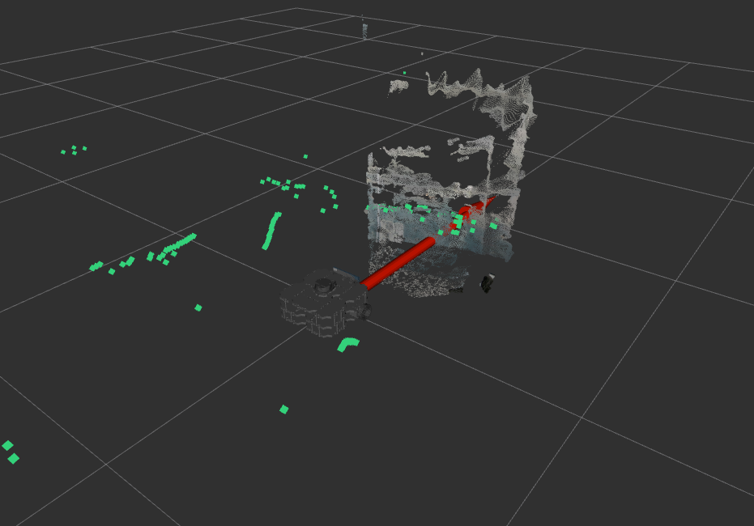
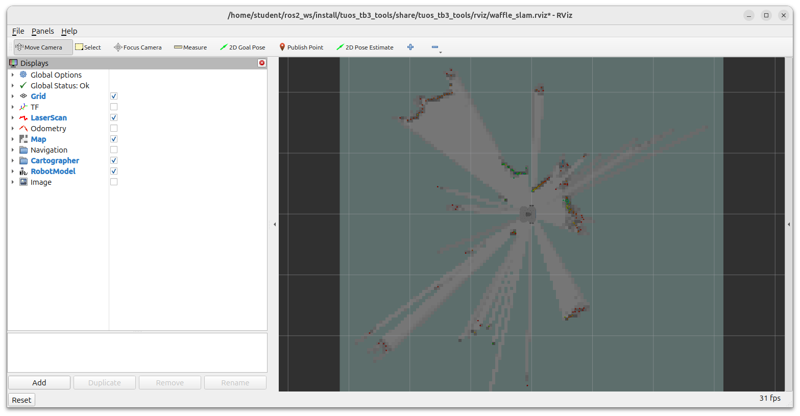
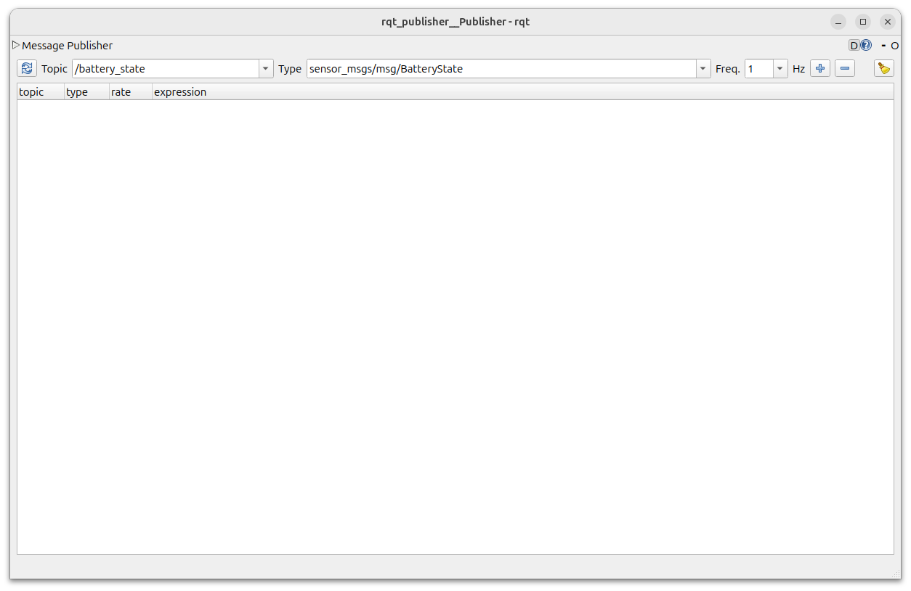
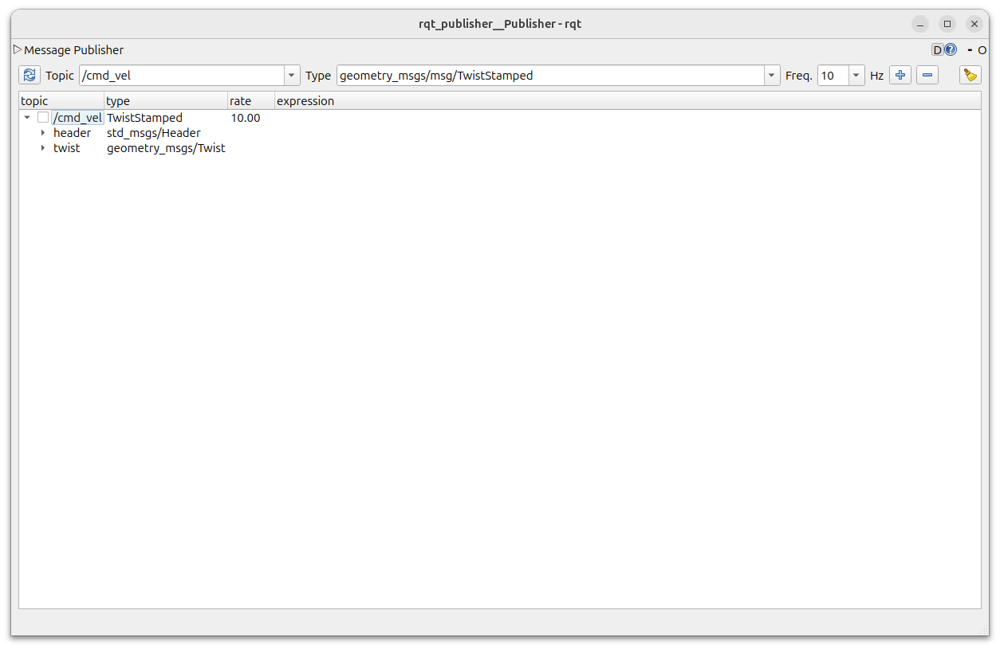
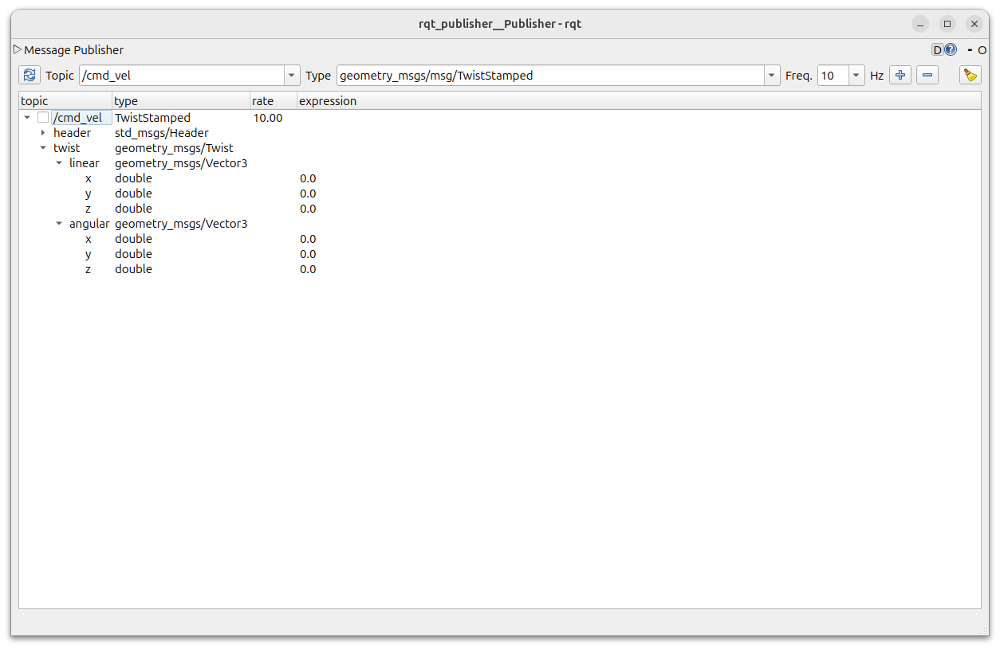
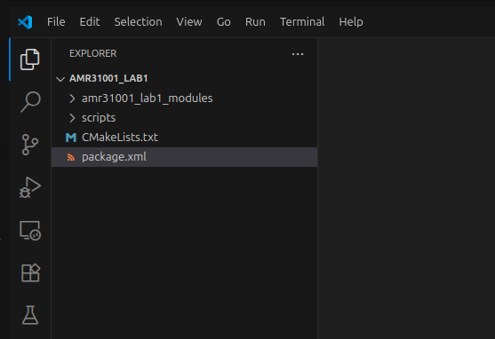
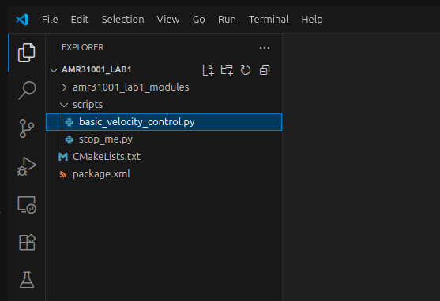

---  
title: "Lab 1: Mobile Robotics"
---  

!!! info 
    You should be able to complete exercises 1-7 on this page within a two-hour lab session.

## Introduction

In this first AMR31001 *'Industry 4.0'* Lab you will learn how to use ROS 2 (the latest version of [the Robot Operating System](https://www.ros.org/){target="_blank"}) to control a robot's motion.

ROS 2 is an open-source, industry-standard robot programming framework, used in a range of industries such as agriculture, warehouse and factory automation and advanced manufacturing. 

ROS 2 allows us to programme robots using a range of different programming languages (including C++, Java, MATLAB etc.), but we'll be using Python for these labs. In addition to this, ROS 2 runs on top of a Linux operating system called *'Ubuntu'*, and so we'll also learn a bit about how to use this too.

We'll be working with robots called *'TurtleBot3 Waffles'*, which you can [find out a bit more about here](../about/robots.md). 

!!! warning "Pre-Lab Work"
    You **must** have completed the Pre-Lab Test before you can make a start on this lab. This is available on the AMR31001 Blackboard Course Page.

!!! info "Assessment Info"
    This lab is **summatively assessed**.

    1. There's a **post-lab quiz** that you'll need to complete after this lab session has taken place, which will be released on Blackboard.
    1. You'll also be marked on the work that you do **in the lab** for [Exercise 7](#ex7).


### Aims

In this lab you'll learn how to use ROS 2 to make a robot move, and we'll also look at how to create our own basic ROS 2 script (or *'Node'*), using Python.

From here on, we'll refer to ROS 2 as *"ROS"* for convenience!

### Intended Learning Outcomes

By the end of this session you will be able to:

1. Control a TurtleBot3 Waffle Robot, from a laptop, using ROS.
1. Launch ROS applications on the laptop and the robot using `ros2 launch` and `ros2 run`.
1. Interrogate a ROS network using ROS *command-line* and *graphical* tools.
1. Use ROS Communication Methods to publish messages.
1. Use a Linux operating system and work within a Linux Terminal.

### Quick Links

* [Exercise 1: Launching ROS and Making your Robot Move](#ex1)
* [Exercise 2: Seeing the Waffle's Sensors in Action!](#ex2)
* [Exercise 3: Visualising the ROS Network](#ex3)
* [Exercise 4: Exploring ROS Topics and Messages](#ex4)
* [Exercise 5: Publishing Velocity Commands to the `/cmd_vel` Topic](#ex5)
* [Exercise 6: Creating a ROS Package](#ex6)
* [Exercise 7: A Python node to make the robot move](#ex7)
* [Exercise 8 (Advanced): Alternative Motion Paths](#ex8)

## The Lab

### Getting Started

Before you do anything, you'll need to get your robot up and running, and make sure ROS is launched.

#### :material-pen: Exercise 1: Launching ROS and Making your Robot Move {#ex1}

You should have already been provided with a Robot and a Laptop (in fact, you're probably already reading this on the laptop!) 

1. First, identify the robot that you have been provided with. Each of our robots are uniquely named: `dia-waffleX`, where `X` is the *'Robot Number'* (a number between 1 and 50). Check the label printed on top of the robot to find out which one you have!

1. Open up a terminal instance on the laptop, either by pressing the ++ctrl+alt+t++ buttons on your keyboard all at the same time, or by clicking the Terminal App icon in the favourites bar on the left-hand side of the desktop:
    
    <figure markdown>
      
    </figure>
        
    We'll refer to this terminal as **TERMINAL 1**.
    
1. In **TERMINAL 1** type the following command to *pair* the laptop and robot, so that they can work together:

    ***
    
    **TERMINAL 1:**
    ``` { .bash .no-copy }
    waffle X pair
    ```
    **... replacing `X` with the number of the robot that you have been provided with**.
    
    ***

1. Enter the password for the robot when requested (we'll tell you what this is in the lab).

    You *may* see a message like this early on in the pairing process:

    <figure markdown>
      {width=600px}
    </figure>

    If so, just type `yes` and then hit ++enter++ to confirm that you want to continue.

1. Once the pairing process is finished you should see a message saying `pairing complete`, displayed in blue in the terminal. 

1. Then, in the same terminal (**TERMINAL 1**), enter the following command:

    ***
    **TERMINAL 1:**
    ``` { .bash .no-copy }
    waffle X term
    ```
    (again, replacing `X` with the number of **your** robot).
    
    ***

    Any text that was in the terminal should now disappear, and a green banner should appear across the bottom of the terminal window:
    
    <figure markdown>
      {width=600px}
    </figure>

    This is a terminal instance running **on the robot**, and any commands that you enter here will be **executed on the robot** (not the laptop!)

1. Now, launch ROS on the robot by entering the following command:

    ***
    **TERMINAL 1:**
    ```bash
    ros2 launch tuos_tb3_tools ros.launch.py enable_depth:=true
    ```

    !!! tip
        To paste text into a Linux terminal you'll need to use the Control + **Shift** + V keyboard keys: ++ctrl+shift+v++

    ***

    If all is well then the robot will play a nice *"do-re-me"* sound and a message like this should appear (amongst all the other text):

    ``` { .txt .no-copy }
    [tb3_status.py-#] ######################################
    [tb3_status.py-#] ### dia-waffleX is up and running! ###
    [tb3_status.py-#] ######################################
    ```

    You shouldn't need to interact with this terminal instance any more now, but the screen will provide you with some regular real-time info related to the status of the robot. As such, keep this terminal open in the background and check on the `Battery` indicator every now and then:

    ``` { .txt .no-copy } 
    Battery: 12.40V [100%]
    ```

    !!! info "Low Battery :material-battery-low:"

        **The robot's battery won't last a full 2-hour lab session!!**

        When the capacity indicator reaches around 15% then it will start to beep, and when it reaches ~10% it will stop working all together.  Let a member of the teaching team know when the battery is running low and we'll replace it for you. (It's easier to do this when it reaches 15%, rather than waiting until it runs below 10%!)

    ROS is now up and running on the robot, and we're ready to go!

    You should leave **TERMINAL 1** alone now, just leave it running in the background for the rest of the lab.

1. The next **crucial step** is to connect the laptop to the ROS network that we've just established on the robot. The two devices will communicate with one another via the University Wireless network, but there's one more step required to link them together. 

    Open up **a new terminal instance** on the laptop (either by using the ++ctrl+alt+t++ keyboard shortcut, or by clicking the Terminal App icon) and enter the following command:

    ***
    **TERMINAL 2:**

    ```bash
    ros2 run rmw_zenoh_cpp rmw_zenohd
    ```
    ***

    Leave both of these terminals alone, but **keep them running in the background at all times** while working with your robot.

1. Next, open up a *new terminal instance* on the laptop (by pressing ++ctrl+alt+t++ or clicking the Terminal App desktop icon, as you did before). We'll call this one **TERMINAL 3**.

1. In **TERMINAL 3** enter the following command:
    
    ***
    **TERMINAL 3:**
    ```bash
    ros2 run turtlebot3_teleop teleop_keyboard
    ```
    ***

1. Follow the instructions provided in the terminal to drive the robot around using specific buttons on the keyboard:

    <figure markdown>
      
    </figure>

1. Enter ++ctrl+c++ in **TERMINAL 3** to stop the Teleop node when you've had enough fun.
    
### Packages and Nodes

ROS applications are organised into *packages*. Packages are basically folders containing scripts, configurations and launch files (ways to launch those scripts and configurations).  

*Scripts* tell the robot what to do and how to act. In ROS, these scripts are called *nodes*. *ROS Nodes* are executable programs that perform specific robot tasks and operations. These are typically written in C++ or Python, but it's possible to write ROS Nodes using other programming languages too.

In Exercise 1 you launched a whole range of different nodes on the ROS Network using the following two commands: 

1. `ros2 launch tuos_tb3_tools ros.launch.py ...` (on the *robot*, in **TERMINAL 1**).
2. `ros2 run turtlebot3_teleop teleop_keyboard` (on the *laptop*, in **TERMINAL 3**).

The first of the above was a ROS 2 `launch` command, which has the following key parts to it (after the `ros2 launch` bit):

``` { .bash .no-copy }
ros2 launch {[1] Package name} {[2] Launch file} {[3] Arguments (optional)}
```

The first **two** of these are the most important: 

**Part [1]** specifies the name of the *ROS package* containing the functionality that we want to execute.  
**Part [2]** is a file within that package that tells ROS exactly what scripts (*'nodes'*) that we want to launch. We can launch multiple nodes at the same time from a single launch file.  

The second command was a ROS 2 `run` command: <a name="ros2-run"></a>

``` { .bash .no-copy }
ros2 run {[1] Package name} {[2] Node name}
```    

Here, **Part [1]** is the same as the `ros2 launch` command, but **Part [2]** is slightly different: `{[2] Node name}`. Here we are directly specifying a single script that we want to execute. We therefore use `ros2 run` if we only want to launch a **single node** on the ROS network (`teleop_keyboard` in this case, which is a Python script).

!!! info "Post-lab"
    What were the names of the two packages that we invoked in Exercise 1?

#### :material-pen: Exercise 2: Seeing the Waffle's Sensors in Action! {#ex2}

Our Waffles have some pretty sophisticated sensors on them, allowing them to "see" the world around them. We won't really make much use of these during this lab, but this next exercise will allow you to see how the data from these devices could be used to help our robots do some very advanced things (with some clever programming, of course!)

##### Part 1: The Camera

1. There shouldn't be anything running in **TERMINAL 3** now, after you closed down the `teleop_keyboard` node at the end of the previous exercise (++ctrl+c++). Return to this terminal and launch the `rqt_image_view` node:

    ***
    **TERMINAL 3:**
    ```bash
    ros2 run rqt_image_view rqt_image_view
    ```
    ***

    !!! info "Post-lab"
        1. We're using `ros2 run` here again, what does this mean?
        1. Why did we have to type `rqt_image_view` twice?
    
1. A new window should open. Maximise this (if it isn't already) and then select `/camera/color/image_raw` from the dropdown menu at the top-left of the application window.
1. Live images from the robot's camera should now be visible! Stick your face in front of the camera and see yourself appear on the laptop screen!
1. Close down the window once you've had enough (enter ++ctrl+c++ in **TERMINAL 3**). This should release **TERMINAL 3** so that you can enter commands in it again.

    The camera on the robot is quite a clever device. Inside the unit is two separate image sensors, giving it - effectively - both a left and right eye. The device then combines the data from both of these sensors and uses the combined information to infer depth from the images as well. Let's have a look at that in action now...

1. In **TERMINAL 3** enter the following command:

    ***
    **TERMINAL 3:**
    ```bash
    ros2 launch tuos_tb3_tools rviz.launch.py
    ```
    ***
    
    This will launch an application called *RViz*, which is a handy tool that allows us to *visualise* the data from all the sensors on-board our robots. When RViz opens, you should see something similar to the following:

    <figure markdown>
      {width=700px}
    </figure>

    In the "Displays" menu on the left-hand side, click on the tick box next to the "DepthCloud" item. 

    <figure markdown>
      {width=600px}
    </figure>

    The strange wobbly sheet of colour that should appear in front of the robot is the live image stream from the camera with depth applied to it at the same time. The camera is able to determine how far away each image pixel is from the camera lens, and then uses that to generate this 3-dimensional representation. 

1. Again, place your hand or your face in front of the camera and hold steady for a few seconds (there may be a bit of a lag as all of this data is transmitted over the WiFi network). You should see yourself rendered in 3D in front of the robot! 

##### Part 2: The LiDAR Sensor

In RViz you may have also noticed a lot of green dots scattered around the robot. This is a representation of the *displacement data* coming from the LiDAR sensor (the black device on the top of the robot). The LiDAR sensor spins continuously, sending out laser pulses into the environment as it does so. When a pulse hits an object it is reflected back to the sensor, and the time it takes for this to happen is used to calculate how far away the object is.
    
The LiDAR sensor spins and performs this process continuously at 1&deg; increments, so a full 360&deg; scan of the environment can be generated. This data is therefore really useful for things like *obstacle avoidance* and *mapping*. We'll have a quick look at the latter now.

1. Close down RViz (click the "Close without saving" button, if asked).

1. Head back to **TERMINAL 3** and run the following command:

    ***
    **TERMINAL 3:**
    ```bash
    ros2 launch tuos_tb3_tools slam.launch.py
    ```
    ***

    A new RViz screen will open up, this time showing the robot from a top-down view, and with the LiDAR data represented by multi-coloured dots this time instead.

    <figure markdown>
      {width=700px}
    </figure>

    Underneath the LiDAR dots you should notice a map starting to form, with black lines representing fixed objects in the environment and white areas representing free space that the robot could travel around. ROS is using a process called *SLAM* (Simultaneous Localisation and Mapping) to generate a map of the environment, using the data from the LiDAR sensor.

1. Open up a new terminal instance now, we'll call this one **TERMINAL 4**. Launch the `teleop_keyboard` node in this one, in the same way that you did earlier:

    ***
    **TERMINAL 4:**
    ```bash
    ros2 run turtlebot3_teleop teleop_keyboard
    ```
    ***

1. Drive the robot around a bit and watch how the map in RViz is updated as the robot explores new parts of the environment.

1. Enter ++ctrl+c++ in **TERMINAL 4** to stop the `teleop_keyboard` node.

1. Close down the RViz window, or enter ++ctrl+c++ in **TERMINAL 3** to stop it too.

We've now used both `ros2 launch` and `ros2 run` to launch ROS applications. These are both ROS *command-line tools*, and there are many others at our disposal. 

Using `ros2 run` and `ros2 launch`, as we have done so far, it's easy to end up with a lot of different processes or *ROS Nodes* running on the network, some of which we will interact with, but others may just be running in the background. It is often useful to know exactly what *is* running on the ROS network, and there are a number of ways to do this.

#### :material-pen: Exercise 3: Visualising the ROS Network {#ex3}

1. There shouldn't be anything running in **TERMINAL 3** now, so return to this terminal and use the `ros2 node` command to *list* the nodes that are currently running on the robot:

    ***
    **TERMINAL 3:**
    ```bash
    ros2 node list
    ```
    ***

    You should see a list of 6 items.

1. We can visualise the connections between the active nodes by using a ROS node called `rqt_graph`. Launch this as follows:

    ***
    **TERMINAL 3:**
    ```bash
    ros2 run rqt_graph rqt_graph
    ```
    ***
    
1. In the window that opens, select `Nodes/Topics (active)` from the dropdown menu in the top left. 

    What you should then see is a map of all the nodes in the list from above (as ovals), and arrows to illustrate the flow of information between them. This is a visual representation of the ROS network!

    <figure markdown>
      {width=600px}
    </figure>
    
    Items that have a rectangular border are *ROS Topics*. ROS Topics are essentially communication channels, and ROS nodes can read (*subscribe*) or write (*publish*) to these topics to access sensor data, pass information around the network and make things happen.

1. Return to **TERMINAL 4** and launch the `teleop_keyboard` node again:

    ***
    **TERMINAL 4:**
    ```bash
    ros2 run turtlebot3_teleop teleop_keyboard
    ```
    ***

1. Go back to the RQT Graph window now and hit the refresh icon (to the left of the `Nodes/Topics (active)` dropdown menu). 

    <figure markdown>
      {width=600px}
    </figure>

    !!! info "Post-lab"
        What's changed? Make sure you know how to interpret these graphs.

A ROS Robot could have hundreds of individual nodes running simultaneously to carry out all its necessary operations and actions. Each node runs independently, but uses *ROS communication methods* to communicate and share data with the other nodes on the ROS Network.

### Publishers and Subscribers: A *ROS Communication Method* 

ROS Topics are key to making things happen on a robot. Nodes can publish (*write*) and/or subscribe to (*read*) ROS Topics in order to share data around the ROS network. We have to use standardised data structures in ROS in order for this to all work. Different topics use different data structures, and there are a lot of different data structure *types* available for us to use (we can even define our own, but this is beyond the scope if this lab session). Let's have a look at Topics and their data structures in a bit more detail now...

#### :material-pen: Exercise 4: Exploring ROS Topics and Interfaces {#ex4}

Much like the `ros2 node list` command, we can use `ros2 topic list` to list all the *topics* that are currently active on the network.

1. Close down the `rqt_graph` window if you haven't done so already. This will release **TERMINAL 3** so that we can enter commands in it again. Leave the `teleop_keyboard` node in **TERMINAL 4** running. Return to **TERMINAL 3** and enter the following:

    ***
    **TERMINAL 3:**
    ```bash
    ros2 topic list
    ```
    ***

    A much larger list of items should be printed to the terminal now. See if you can spot `/cmd_vel` in the list.
    
    This topic is used to control the velocity of the robot (*'command velocity'*).

1. Let's find out more about this using the `ros2 topic info` command.

    ***
    **TERMINAL 3:**
    ```bash
    ros2 topic info /cmd_vel
    ```
    ***

    This should provide an output similar to the following: 
    
    ``` { .txt .no-copy }
    Type: geometry_msgs/msg/TwistStamped
    Publisher count: 1
    Subscription count: 1
    ```

    This tells us a few things: <a name="rostopic_info_explained"></a>
    
    1. The `/cmd_vel` topic currently has 1 publisher (i.e. 1 node writing data to the topic).
    1. There's also 1 *subscriber* (i.e. another node reading the data being written to the topic).
    1. If we think back to `rqt_graph` (from the previous exercise), we know that the publisher is the `/teleop_keyboard` node, and the subscriber is a node called `/turtlebot3_node`. This node turns the topic data into motor commands, resulting in actual motion of the robot's wheels.
    1. The *type* of data structure used by the `/cmd_vel` topic is defined as:  
        
        <center>`geometry_msgs/msg/TwistStamped`</center>
        
        This is a ROS *"Interface"*. 

        **Interfaces**
    
        Data structures in ROS 2 are called *Interfaces*. 
        
        From the output above, `Type` refers to the *type* of data structure (i.e. the type of interface). The `Type` definition has three parts to it: `geometry_msgs`, `msg` and `TwistStamped`:
        
        1. `geometry_msgs` is the name of the ROS package that this interface (data structure) belongs to
        1. `msg` tells us that it's a topic *message* interface (rather than another interface type, of which there are others, but we don't need to worry about them here)
        1. `TwistStamped` is the *name* of the message interface. 

        We have just learnt then, that if we want to make the robot move we need to publish `TwistStamped` interface *messages* to the `/cmd_vel` topic. 

1. We can use the `ros2 interface` command to find out more about the `TwistStamped` message:

    ***
    **TERMINAL 3:**
    ```bash
    ros2 interface show geometry_msgs/msg/TwistStamped
    ```
    ***

    From this, the bottom bit is of most interest to us: <a name="show-twist"></a>

    ``` { .txt .no-copy }
    Twist twist
            Vector3  linear
                    float64 x
                    float64 y
                    float64 z
            Vector3  angular
                    float64 x
                    float64 y
                    float64 z
    ```

    Hmmm, this looks complicated. Let's find out what it all means...

### Velocity Control

The motion of any mobile robot can be defined in terms of its three *principal axes*: `X`, `Y` and `Z`. In the context of our TurtleBot3 Waffle, these axes (and the motion about them) are defined as follows:

<figure markdown>
  {width=700px}
</figure>

In theory then, a robot can move *linearly* or *angularly* about any of these three axes, as shown by the arrows in the figure. That's six *Degrees of Freedom* (DOFs) in total, achieved based on a robot's design and the actuators it is equipped with. Take a look back at the `ros2 interface show` output in **TERMINAL 3**. Hopefully it's a bit clearer now that these topic messages are formatted to give a ROS Programmer the ability to *ask* a robot to move in any one of its six DOFs. 

``` { .txt .no-copy }
Vector3  linear
        float64 x  <-- Forwards (or Backwards)
        float64 y  <-- Left (or Right)
        float64 z  <-- Up (or Down)
Vector3  angular
        float64 x  <-- "Roll"
        float64 y  <-- "Pitch"
        float64 z  <-- "Yaw"
```

Our TurtleBot3 only has two motors, so it doesn't actually have six DOFs! These two motors can be controlled independently, in a *"differential drive"* configuration, but this still only allows it to move with **two degrees of freedom** in total, as illustrated below.

<figure markdown>
  {width=700px}
</figure>

Velocity can therefore only be applied **linearly** in the **x-axis** (*Forwards/Backwards*) and **angularly** in the **z-axis** (*Yaw*). 

!!! info "Post-lab"
    Take note of all this, there may be a question on it!

#### :material-pen: Exercise 5: Publishing Velocity Commands to the "cmd_vel" Topic {#ex5}

1. Stop the `teleop_keyboard` node now by entering ++ctrl+c++ in **TERMINAL 4**. We're going to use another graphical tool to help us publish messages to the `/cmd_vel` topic *directly* now.
1. Go back to **TERMINAL 3** and enter the following command to launch the *RQT Message Publisher* node:

    ***
    **TERMINAL 3:**
    ```bash
    ros2 run rqt_publisher rqt_publisher
    ```
    ***

    <figure markdown>
      {width=600px}
    </figure>

1. In the "**Topic**" dropdown menu select `/cmd_vel`.

1. Move along to the right and enter a value of `10` in the box next to the "**Freq.**" label.

1. Further to the right, click on the :material-plus-box: box to add this as a publisher to the main *"Publisher Table"*.

1. In the Publisher Table, click on the :octicons-triangle-right-16: next to `/cmd_vel`, to expand the item and reveal two further items: `header` and `twist`:

    <figure markdown>
      {width=600px}
    </figure>

1. Click on the :octicons-triangle-right-16: icon next to `twist`, and then the subsequent :octicons-triangle-right-16: icons next to the `linear` and `angular` items that appear below this. Finally, you'll see some values in the "**expression**" column:

    <figure markdown>
      {width=600px}
    </figure>

    Does this look familiar to [the interface definition as we viewed it in the terminal before](#show-twist)?

1. Using what we learnt above about the way the robot can actually move, change **one** of the six values in the "expression" column that you think might make robot ***rotate on the spot***. Before you do this, it's worth noting the following things:
    
    1. The unit of *linear* velocity is meters per second (m/s).
    1. The unit of *angular* velocity is radians per second (rad/s).
    1. Our Waffle robots can move with a **maximum linear velocity** of 0.26 m/s and a **maximum angular velocity** of 1.82 rad/s.

1. Once you've entered a value, click on the checkbox to the left of `/cmd_vel` to start publishing these values to the topic. Observe what your robot does!

1. Set the value back to `0.0` and then hit ++enter++ to make the robot stop moving.

1. Next, find an alternative velocity value that you can set in order to make the robot ***move forwards*** this time. (Don't forget to set the value back to `0.0` to make the robot stop moving again afterwards.)

1. Finally, enter a *combination* of velocity values to make the robot ***move in a circle***.

1. Once you're finished, set all velocities back to `0.0`, make sure the robot is no longer moving, and then uncheck the box next to `/cmd_vel` to stop publishing messages. Click on the :material-close-circle: button in the top right-hand corner of the Message Publisher window to close it down.

Hopefully you can see now that, in order to make a robot move, it's simply a case of publishing the right ROS Interface Message (`TwistStamped`) to the right ROS Topic (`/cmd_vel`). Earlier on in the lab we used the `teleop_keyboard` node to drive the robot around, a bit like a remote control car. In the background here all that was really happening was that the node was converting our keyboard button presses into velocity commands and publishing these to the `/cmd_vel` topic. In the previous exercise we looked at this in a bit more detail by actually directly applying values to the right message attributes and using the RQT Message Publisher to publish these for us. As I'm sure you can appreciate though, there's a limit to what we can achieve by working in this way though(circular and straight line motion is about it!)

In reality, robots need to be able to move around complex environments autonomously, which is quite a difficult task, and requires us to build bespoke applications. We can build these applications using Python, and we'll look at the core concepts behind this in the following exercises, starting by building a simple Node that will allow us to make our robot a bit more "autonomous". What we will do here forms the basis of the more complex approaches used by robotics engineers to *really* bring robots to life!

#### :material-pen: Exercise 6: Creating a ROS Package {#ex6}

As we learnt earlier, all ROS nodes must be contained within *packages*, so in order for us to create our own node, we first need to create our own package.

1. In **TERMINAL 3** run the following command to navigate to a folder called the *"ROS Workspace"* using the `cd` ("change directory") command:

    ```bash
    cd ~/ros2_ws/src
    ```

1. Next run the following command to copy a package template from GitHub into the ROS Workspace folder:

    ```bash
    git clone https://github.com/tom-howard/ros2_pkg_template.git
    ```

1. Now, run a script from within this template, to initialise the package for use:

    ```bash
    ./ros2_pkg_template/init_pkg.sh amr31001_lab1
    ```

1. We're going to open this package in a text editor called *Visual Studio Code* (aka "VS Code") now, so that we can start making changes to it:

    ```bash
    code ./amr31001_lab1
    ```

1. When VS Code opens, you should see a *File Explorer* on the left-hand side which allows you to access all the files and folders within your package. 
    
    <figure markdown>
      {width=400px}
    </figure>

    Look for a file here called `package.xml` and click on it. This will open this file in the main VS Code window, to allow you to edit it.

1. Look for the following lines in the `package.xml` file:

    ``` title="package.xml"
    <maintainer email="your.name.1@sheffield.ac.uk">Name 1</maintainer>
    <maintainer email="your.name.2@sheffield.ac.uk">Name 2</maintainer>
    ```

    Change `Name 1` to your name, and then change `your.name.1@sheffield.ac.uk` to your Sheffield email address! Then, do the same for your other Group member on the line below it. (If you're working in a group of more than 2 people, then you can add additional lines below this for your other group members.)

    !!! warning "Post-lab"
        **This is important for the post-lab**!

        We'll be assessing your work here as part of the post-lab, so it's important that we can identify each member of your group. If any group members aren't listed here, then they won't receive any marks for this! 

        When entering your names, make sure you provide first names **AND** surnames for each group member.

1. Go back to **TERMINAL 3** now and run the following three commands:

    1. First: 
        
        ```bash
        cd ~/ros2_ws
        ```
    
    1. Then:

        ```bash
        colcon build --symlink-install --packages-select amr31001_lab1
        ```

    1. And finally:

        ```bash
        source ~/.bashrc
        ```

OK, **package creation is now complete**, so we're ready to start some Python programming...

#### :material-pen: Exercise 7: A Python node to make the robot move {#ex7}

Go back to VS Code now, and (in the File Explorer) look for a folder called `scripts`. Click on the :material-chevron-right: icon next to this to expand the folder and reveal its content. A file called `basic_velocity_control.py` should be revealed. Click on this to open it in the main editor window.

<figure markdown>
  {width=400px}
</figure>

This is a (fairly) basic ROS 2 Python Node that will control the velocity of the robot. Let's talk through it:
    
1. First, we have some imports:

    ```py
    import rclpy # (1)!
    from geometry_msgs.msg import TwistStamped # (2)!
    import time # (3)!
    ```

    1. `rclpy` is the ROS client library for Python. We need this so that our Python node can interact with ROS.
    2. [We know from earlier](#ex4) that in order to make a robot move we need to publish messages to the `/cmd_vel` topic, and that this topic uses a data structure (or Interface) called `geometry_msgs/msg/TwistStamped`. This is how we import the interface into our Python node so that we can create velocity commands for our robot (which we'll get to shortly...)
    3. We'll use this to control timing in our node.

    Click on the :material-plus-circle: icons above to reveal more information about each line of the code.

1. Next, we declare some variables that we can use and adapt during the main execution of our code:

    ```py
    state = 1 # (1)!
    vel = TwistStamped() # (2)!
    ```

    1. Inside the `#!py while` loop (explained shortly) we define two different operational states for the robot, and we can control which one is active by changing this value from `1` to `2` (and visa-versa).
    2. We're instantiating a `TwistStamped` Interface message here and calling it `vel`. We'll assign velocity values to this in the `#!py while` loop later on.
        
        Recall that a `TwistStamped` message contains six different components that we can assign values to. [Which *two* are relevant to our robot](#velocity-control)?

1. Next we configure some important ROS-related things:

    ```py
    rclpy.init(args=None) # (1)!
    node = rclpy.create_node("basic_velocity_control")  # (2)!
    vel_pub = node.create_publisher(TwistStamped, "cmd_vel", 10)  # (3)!
    ```

    1. Initialise `rclpy` and all the ROS communications that are necessary for our node. 
    2. Initialise this Python script as an actual ROS node, providing a name for it to be registered on the ROS network with ("basic_velocity_control" in this case).
    3. Here we're setting up a publisher to the `/cmd_vel` topic so that the node can send velocity commands to the robot (using `TwistStamped` data).

1. After this, we're defining another variable:

    ```py
    timestamp = node.get_clock().now().nanoseconds # (1)!
    ```

    1. What time is it right now? This tells us the current "ROS Time" (in nanoseconds), which will be useful to compare against in the while loop.

1. Now, we enter into a `#!py while` loop, which is where our code will spend the majority of its time once it's running:

    ```py
    while rclpy.ok(): # (1)!
        time_now = node.get_clock().now().nanoseconds # (2)!
        elapsed_time = (time_now - timestamp) * 1e-9 # (3)!

        ...

    ```

    1. This returns `#!py True` as long as the node is alive, so all the code inside the `#!py while` loop will continue to execute as long as this is the case.
    2. What time is it *now*? Check the time at the start of each iteration of the `#!py while` loop, and assign this to a variable called `time_now`.
    3. Determine how much time has elapsed (in seconds) since the `timestamp` was last updated.

    Everything that's indented below the `#!py while rclpy.ok():` line will continue to be executed over and over again until we ask our node to stop. The code will execute line-by-line from top-to-bottom within this `#!py while` loop, and will then go back to the top again and repeat it all over and over and *over* again! Each repeat is called an *"iteration"*.

    1. An `#!py if` statement now controls the state of operation for our robot. 
        
        1. In state `1` we set velocities that will make the robot move forwards (linear X velocity only) for a certain amount of time and then stop. How long will the robot move forwards for, and at what velocity?

            ```py
            if state == 1: 
                if elapsed_time < 2: # (1)!
                    vel.twist.linear.x = 0.05 # (2)!
                    vel.twist.angular.z = 0.0
                else: # (3)!
                    vel.twist.linear.x = 0.0 # (4)!
                    vel.twist.angular.z = 0.0
                    state = 2 # (5)!
                    timestamp = node.get_clock().now().nanoseconds # (6)!
            ```

            1. If the elapsed time is less than 2 seconds...
            2. Set a linear velocity so that the robot will move forwards.
            3. If the elapsed time has *exceeded* 2 seconds...
            4. Set our robot's velocities to `0.0` to make it stop.
            5. In the next loop iteration, go into state 2 instead.
            6. Reset the timestamp to start counting up again. 

        2. In state `2` we set velocities that will make the robot turn on the spot (angular Z velocity only) for a certain amount of time and then stop. How long will it do this for, and at what velocity?
            
            ```py
            elif state == 2:
                if elapsed_time < 4: # (1)!
                    vel.twist.linear.x = 0.0
                    vel.twist.angular.z = 0.2 # (2)!
                else: # (3)!
                    vel.twist.linear.x = 0.0 # (4)!
                    vel.twist.angular.z = 0.0 
                    state = 1 # (5)!
                    timestamp = node.get_clock().now().nanoseconds # (6)!
            ```

            1. While the elapsed time is less than 4 seconds...
            2. Apply an angular velocity to the robot to make it turn on the spot.
            3. Once the elapsed time has *exceeded* 4 seconds...
            4. Set the robot's velocities back to `0.0` to make it stop.
            5. In the next loop iteration, go back into state 1 again (moving forwards).
            6. Reset the timestamp to start counting up once more. 

    1. And after the `#!py if` statement:

        ```py
        node.get_logger().info( # (1)!
            f"\n[State = {state}] Publishing velocities:\n"
            f"  - linear.x: {vel.twist.linear.x:.2f} [m/s]\n"
            f"  - angular.z: {vel.twist.angular.z:.2f} [rad/s].",
            throttle_duration_sec=1,
        )
        vel_pub.publish(vel) # (2)!
        ```

        1. This (and the following 5 lines) will print a message to the terminal, to provide us with regular updates on what state the node is currently in and what velocities have been set (in the `#!py if` statement above).
        2. This line is crucial: this operation actual publishes the velocity commands to the `/cmd_vel` topic, to make the robot actual act on our instructions.

            Regardless of what happens in the `if` states above, we *always* publish a velocity command to the `/cmd_vel` topic here (every loop iteration).


1. Go back to **TERMINAL 3** now, run the code and see what happens. *Make sure the robot is on the floor and has enough room to roam around before you do this*!
    
    ***
    **TERMINAL 3:**
    ```bash
    ros2 run amr31001_lab1 basic_velocity_control.py
    ```
    ***
    
    Enter ++ctrl+c++ in **TERMINAL 3** to stop the node from running once you've seen enough.
    
    !!! warning
        The robot will continue to move even after you've stopped the node! Run the following command to stop it:
        
        ```bash
        ros2 run amr31001_lab1 stop_me.py
        ```
    
1. **Your Task**:
    
    The aim here is to make the robot follow a **square motion path** of dimensions **0.5m x 0.5m**. As it is though, the `basic_velocity_control.py` node doesn't actually do this yet, and you need to fix it!
        
    Edit the code so that the robot actually follows a **0.5m x 0.5m square motion path**!

    !!! info "Post-lab"
        As discussed above, your completion of this exercise will be assessed as part of the post-lab!

#### :material-pen: Exercise 8 (Advanced): Alternative Motion Paths {#ex8}

*If you have time, have a go at this now...*

How could you adapt the code further to achieve some more interesting motion profiles?

1. First, go back to **TERMINAL 3** and make sure you're in the right file system location:

    ```bash
    cd ~/ros2_ws/src/amr31001_lab1/scripts
    ```

1. Then, make a copy of the `basic_velocity_control.py` code using the `cp` command (**c**o**p**y):

    ```bash
    cp basic_velocity_control.py alt_velocity_control.py
    ```
    Which will create a copy called `alt_velocity_control.py`

1. Use the following command to open up a text file in VS Code:

    ```bash
    code ../CMakeLists.txt
    ```

1. In this file, locate the lines (near the bottom of the file) that read:

    ``` { .txt .no-copy}
    # Install Python executables
    install(PROGRAMS
      scripts/basic_velocity_control.py
      scripts/stop_me.py
      DESTINATION lib/${PROJECT_NAME}
    )
    ```

    Insert a new line below the one that reads `scripts/basic_velocity_control.py`, so that it now looks like this:

    ``` { .txt .no-copy }
    # Install Python executables
    install(PROGRAMS
      scripts/basic_velocity_control.py
      scripts/alt_velocity_control.py
      scripts/stop_me.py
      DESTINATION lib/${PROJECT_NAME}
    )
    ```

    You've just added `alt_velocity_control.py` as a new node within your package. 

    Save the file and close it.

1. Go back to **TERMINAL 3** and run the following 3 commands again, in order:

    1. First: 
        
        ```bash
        cd ~/ros2_ws
        ```
    
    1. Then:

        ```bash
        colcon build --symlink-install --packages-select amr31001_lab1
        ```

    1. And finally:

        ```bash
        source ~/.bashrc
        ```

1. Go back to VS Code and find your new `alt_velocity_control.py` file. Click on it to open it in the editor.
    
1. **NOW** see if you can edit this to achieve either of the more complex motion profiles illustrated below.

    <figure markdown>
      
    </figure>

    1. **Profile (a):** The robot needs to follow a *figure-of-eight* shaped path, where a linear and angular velocity command are set simultaneously to generate circular motion. Velocities will need to be defined in order to achieve **a path diameter of 1m** for each of the two loops. Having set the velocities appropriately, you'll then need to work out how long it would take the robot to complete each loop, so that you can determine when the robot should have got back to its starting point. At this point you'll need to change the turn direction, so that the robot switches from anti-clockwise to clockwise turning. 
    1. **Profile (b):** The robot needs to start and end in the same position, but move through intermediate points 1-7, in sequence, to generate the *stacked square* profile as shown. Each of the two squares must be **1m x 1m in size**, so you'll need to find the right velocity and duration pairs for moving forward and turning. You'll also need to change the turn direction once the robot reaches Point 3, and then again at Point 7!

1. To run the file and test it out, you'll need to use `ros2 run ...`. How would you format this command ([recall this](#ros2-run))?[^run-alt]

    Whenever you need to stop the node, enter ++ctrl+c++ in the terminal.

    [^run-alt]: `#!bash ros2 run amr31001_lab1 alt_velocity_control.py`

    !!! warning "Remember"
        The robot will continue to move even after you've stopped the node! Run the following command to stop it whenever you need to:
        
        ```bash
        ros2 run amr31001_lab1 stop_me.py
        ```

## Wrapping Up

Before you leave, please shut down your robot! Enter the following command in **TERMINAL 3** to do so:

***
**TERMINAL 3:**
``` { .bash .no-copy }
waffle X off
```
... again, replacing `X` with the number of the robot that you have been working with today.
***

You'll need to enter `y` and then hit ++enter++ to confirm this.

Please then shut down the laptop, which you can do by clicking the battery icon in the top right of the desktop, clicking the Power icon (illustrated below) and then selecting "Power Off..." in the menu.

<figure markdown>
  {width=300px}
</figure>

<center>

**AMR31001 Lab 1 Complete!**  
*See you in the new year for Lab 2!*

</center>