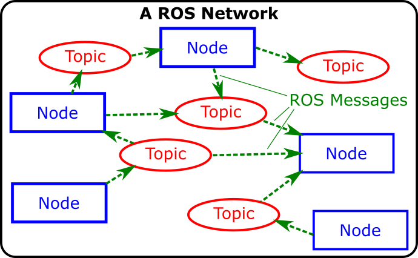
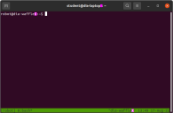
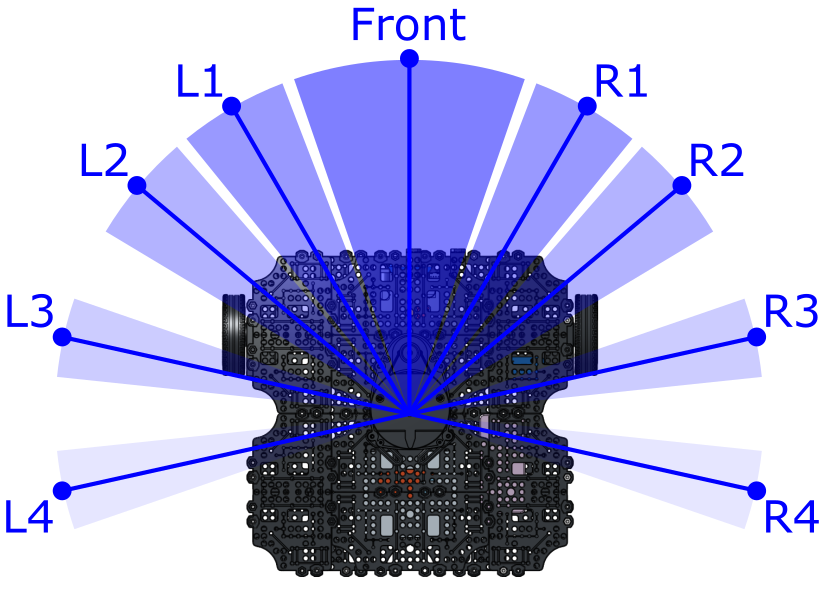

---  
title: "Lab 2: Feedback Control" 
---  

## Introduction

In Lab 1 we explored how ROS works and how to bring a robot to life. Let's quickly recap the key points:

**Nodes**

* Are executable programs (Python, C++ scripts) that perform specific robot tasks and operations.
* Typically, there'll be many Nodes running on a robot simultaneously in order to make it work.
* We can create our own Nodes on top of what's already running, to add extra functionality.
* You may recall that we created our own Node (in Python) to make our TurtleBot3 Waffle follow a square motion path.

<figure markdown>
  {width=500px}
</figure>

**Topics and Message interfaces**

* All the ROS Nodes running on a network can communicate and pass data between one another using a Publisher/Subscriber-based Communication Principle.
* ROS Topics are key to this - they are essentially the communication channels (or the plumbing) on which all data is passed around between the nodes.
* Different topics communicate different types of information using standardised data structures (called *"Message Interfaces"*).
* Any Node can publish (*write*) and/or subscribe to (*read*) any ROS Topic in order to pass information around or make things happen.

<figure markdown>
  {width=500px}
</figure>

One of the key ROS Topics that we worked with last time was `/cmd_vel`, which is a topic that communicates velocity commands to make a robot move. You may recall that to make our TurtleBot3 Waffle move, we publish `TwistStamped` *Interface Messages* to the `/cmd_vel` topic. Interfaces messages are *structured data types* defined in ROS, and we will remind ourselves about the structure of the `TwistStamped` data type shortly...

**Open-Loop Control**

We used a time-based method to control the motion of our robot in order to get it to generate a square motion path. This type of control is *open-loop*: we hoped that the robot had moved (or turned) by the amount that was required, but had no *feedback* to tell us whether this had actually been achieved.

**Closed-Loop Control**

In this lab we'll look at how this can be improved, making use of some of our robot's on-board sensors to tell us where the robot is or what it can see in its environment, in order to complete a task more reliably and be able to better adapt to changes and uncertainty in the environment.

### Aims

In this lab, we'll build some ROS Nodes (in Python) that incorporate data from some of our robot's sensors. This sensor data is published to specific topics on the ROS Network, and we can build ROS Nodes to *subscribe* to these. We'll see how the data from these sensors can be used as *feedback* to inform decision-making, thus allowing us to implement some different forms of *closed-loop control*, and make our robot more autonomous. 

### Intended Learning Outcomes

By the end of this session you will be able to:

1. Interpret the data from a ROS Robot's Odometry System and understand what this tells you about a Robot's position and orientation within its environment.
1. Use feedback from a robot's odometry system to *control* its position in an environment.
1. Use data from a Robot's LiDAR sensor to make a robot follow a wall.
1. Analyse images from a Robot's Camera and use this information to follow a coloured line on the floor.

### Quick Links

* [Exercise 1: Exploring Odometry Data](#ex1)
* [Exercise 2: Odometry-based Navigation](#ex2)
* [Exercise 3: Wall Following](#ex3)
* [Exercise 4: Line Following](#ex4)

## The Lab

!!! info "Assessment Info"
    This lab is **summatively assessed**.

    1. There's a **post-lab quiz** that you'll need to complete after this lab session has taken place, which will be released on Blackboard.
    1. You'll also be marked on the work that you do **in the lab** for [Exercise X (TODO)]().

### Getting Started

#### Creating a ROS Package

We'll need a ROS package to work with for this lab session. We've created a template for you, which contains all the resources that you'll need for today. Download and install this as follows.

1. Open up a terminal instance on the laptop, either by using the ++ctrl+alt+t++ keyboard shortcut, or by clicking the Terminal App icon in the favourites bar on the left-hand side of the desktop:
    
    <figure markdown>
      {width=60px}
    </figure>

    We'll call this **TERMINAL 1**.

1. In **TERMINAL 1**, run the following commands in order:

    !!! tip
        To **paste** the following commands into the terminal use ++ctrl+shift+v++
    
    ***
    **TERMINAL 1**:
    ```txt
    cd ~/ros2_ws/src/
    ```
    
    ```txt
    git clone https://github.com/tom-howard/amr31001_lab2.git
    ```
    
    ```txt
    cd ~/ros2_ws && \
      colcon build --symlink-install \
      --packages-select amr31001_lab2 && \
      source ~/.bashrc 
    ```
    ***

1. Next, open the package in VS Code:

    ```bash
    code ./src/amr31001_lab2
    ```

1. When VS Code opens, navigate to the *File Explorer*: 
    
    <figure markdown>
      {width=400px}
    </figure>

    ... find a file here called `package.xml` and click on it. 

1. Look for the following lines in the `package.xml` file:

    ``` title="package.xml"
    <maintainer email="name1@sheffield.ac.uk">Name 1</maintainer>
    <maintainer email="name2@sheffield.ac.uk">Name 2</maintainer>
    ```

    Change `Name 1` to your name, and then change `name1@sheffield.ac.uk` to your Sheffield email address! Then, do the same for your other Group member on the line below it. (If you're working in a group of more than 2 people, then you can add additional lines below this for your other group members.)

    !!! warning "Post-lab"
        **This is important for the post-lab**!

        Some of the work that you do in this lab will be assed as part of the post-lab, so it's important that we can identify each member of your group. If any group members aren't listed here, then they won't receive any marks! 

        When entering your names, make sure you provide first names **AND** surnames for each group member.

1. Save the changes that you have just made to your `package.xml` file.

#### Launching ROS

Much the same as last time, you'll now need to get ROS up and running on your robot. 

1. First, identify the robot that you have been provided with. Each of our robots are uniquely named: `dia-waffleX`, where `X` is the *'Robot Number'* (a number between 1 and 50). Check the label printed on top of the robot to find out which one you have!

1. In **TERMINAL 1** type the following command to *pair* the laptop and robot, so that they can work together:

    ***
    
    **TERMINAL 1**:
    ``` { .txt .no-copy }
    waffle X pair
    ```
    **... replacing `X` with the number of the robot that you have been provided with**.
    
    ***

1. Enter the password for the robot when requested (we'll tell you what this is in the lab).

    You *may* see a message like this early on in the pairing process:

    <figure markdown>
      {width=600px}
    </figure>

    If so, just type `yes` and then hit ++enter++ to confirm that you want to continue.

1. Once the pairing process is finished you should see a message saying `pairing complete`, displayed in blue in the terminal. 

1. Then, in the same terminal (**TERMINAL 1**), enter the following command:

    ***
    **TERMINAL 1:**
    ``` { .txt .no-copy }
    waffle X term
    ```
    (again, replacing `X` with the number of **your** robot).
    
    ***

    Any text that was in the terminal should now disappear, and a green banner should appear across the bottom of the terminal window:
    
    <figure markdown>
      {width=600px}
    </figure>

    This is a terminal instance running **on the robot**, and any commands that you enter here will be **executed on the robot** (not the laptop!)

1. Now, launch ROS on the robot by entering the following command:

    ***
    **TERMINAL 1:**
    ```bash
    ros2 launch tuos_tb3_tools ros.launch.py
    ```

    !!! tip
        To paste text into a Linux terminal you'll need to use the Control + **Shift** + V keyboard keys: ++ctrl+shift+v++

    ***

    If all is well then the robot will play a nice *"do-re-me"* sound and a message like this should appear (amongst all the other text):

    ``` { .txt .no-copy }
    [tb3_status.py-#] ######################################
    [tb3_status.py-#] ### dia-waffleX is up and running! ###
    [tb3_status.py-#] ######################################
    ```

    ROS is now up and running on the robot, and we're ready to go!

1. Next, connect the laptop to the ROS network that we've just established on the robot. The Robot and Laptop communicate with one another via the University Wireless network, but there's one more step required to link them together. 

    Open up **a new terminal instance** on the laptop (either by using the ++ctrl+alt+t++ keyboard shortcut, or by clicking the Terminal App icon) and enter the following command:

    ***
    **TERMINAL 2**:
    ```bash
    ros2 run rmw_zenoh_cpp rmw_zenohd
    ```
    ***

    Leave **TERMINAL 1** and **TERMINAL 2** running in the background at all times while working with your robot in the lab today.

### Odometry

First, let's look at our robot's *odometry* system, and what this is useful for.

> Odometry is the use of data from motion sensors to estimate change in position over time. It is used in robotics by some legged or wheeled robots to estimate their position relative to a starting location. [^wiki]

[^wiki]: https://en.wikipedia.org/wiki/Odometry

Our robot can therefore keep track of its position (and orientation) as it moves around. It does this using data from two sources:

1. **Wheel encoders**: Our robot has two wheels, each is equipped with an encoder that measures the number of rotations that the wheel makes. 
1. An **Inertial Measurement Unit (IMU)**: Using accelerometers, gyroscopes and compasses, the IMU can monitor the linear and angular velocity of the robot, and which direction it is heading, at all times.

This data is published to a ROS Topic called `/odom`. 

#### :material-pen: Exercise 1: Exploring Odometry Data {#ex1}

In the previous lab we used some ROS commands to identify and interrogate active topics on the ROS network, let's give that another go now, but on the `/odom` topic this time.

1. Open up a new terminal instance on the laptop (by pressing ++ctrl+alt+t++, or clicking the Terminal App desktop icon, as you did before). We’ll call this one **TERMINAL 3**.

1. As you may recall from last time, we can use the `ros2 topic` command to *list* all the topics that are currently active on the network. Enter the following in **TERMINAL 3**:

    ***
    **TERMINAL 3**:
    ```bash
    ros2 topic list
    ```
    ***

    A large list of items should appear on the screen. Can you spot the `/odom` topic?
    
1. Let's find out more about this using the `ros2 topic info` command.

    ***
    **TERMINAL 3**:
    ```txt
    ros2 topic info /odom
    ```
    ***

    This should provide the following output:
    
    ```{ .txt .no-copy }
    Type: nav_msgs/msg/Odometry
    Publisher count: 1
    Subscription count: 0
    ```

    !!! info "Post-lab Quiz"
        What does all this mean? We discussed this [last time (in relation to the `/cmd_vel` topic)](./lab1.md#rostopic_info_explained), and you may want to have a look back at this to refresh your memory! 
    
    Based on the above, we know that the `/odom` topic uses a `nav_msgs/msg/Odometry` data structure (or *"interface"*). 
    
    **Interfaces** (revisited)
    
    Recall from Lab 1 that data structures in ROS 2 are called *Interfaces*. 
        
    From the output above, `Type` refers to the *type* of data structure (i.e. the type of interface). The `Type` definition always has three parts to it, in this case: `nav_msgs`, `msg` and `Odometry`:
        
    1. `nav_msgs` is the name of the ROS package that this interface (data structure) belongs to
    1. `msg` tells us that it's a topic *message* interface (rather than another interface type, of which there are others, but we don't need to worry about them here)
    1. `Odometry` is the *name* of the message interface.
    
1. We can use the `ros2 interface` command to find out more about this:

    ***
    **TERMINAL 3**:
    ```txt
    ros2 interface show nav_msgs/msg/Odometry
    ```
    ***

    You'll see a lot of information there, but try to find the line that reads `Pose pose`: 

    ``` { .txt .no-copy }
    Pose pose
            Point position
                    float64 x
                    float64 y
                    float64 z
            Quaternion orientation
                    float64 x 0
                    float64 y 0
                    float64 z 0
                    float64 w 1
    ```

    Here's where we'll find information about the robot's position and orientation (aka *"Pose"*) in the environment. Let's have a look at this data in real time...

1. We can look at the live data being streamed across the `/odom` topic, using the `ros2 topic echo` command. We know that the data type is called `nav_msgs/msg/Odometry`, and nested within this is the `pose` attribute that we are interested in, so:

    ***
    **TERMINAL 3**:
    ```txt
    ros2 topic echo /odom --field pose.pose
    ```
    ***

1. What we're presented with now is live Odometry data from the robot.
    
    Let's drive the robot around a bit and observe how our robot's pose changes as we do so.
    
1. Open up a new terminal instance by pressing ++ctrl+alt+t++, or clicking the Terminal App desktop icon, as you did before. We'll call this one **TERMINAL 4**:

    ***
    **TERMINAL 4**:
    ```bash
    ros2 run turtlebot3_teleop teleop_keyboard
    ```
    ***

1. Follow the instructions provided in the terminal to drive the robot around:

    ??? tip "Reminder"

        <figure markdown>
          
        </figure>

    As you're doing this, look at how the `position` and `orientation` data is changing in **TERMINAL 3**, in real-time!

    !!! info "Post-lab Quiz"
        Which position and orientation values change (by a significant amount) when:
            
        1. The robot turns on the spot (i.e. only an *angular* velocity is applied)?
        1. The robot moves forwards (i.e. only a *linear* velocity is applied)?
        1. The robot moves in a circle (i.e. both a linear *and* angular velocity are applied simultaneously)?

        **Make a note of the answers to these questions, as they may feature in the post-lab quiz!**

1. When you've seen enough enter ++ctrl+c++ in **TERMINAL 4** to stop the `teleop_keyboard` node. Then, enter ++ctrl+c++ in **TERMINAL 3** as well, which will stop the live stream of Odometery messages from being displayed.

##### Summary

**Pose** is a combination of a robot's *position* and *orientation* in its environment.

**Position** tells us the location (in meters) of the robot in its environment. Wherever the robot was when it was turned on is the reference point, and so the distance values that we observed in the exercise above were all quoted relative to this initial position.

You should have noticed that (as the robot moved around) the `x` and `y` terms changed, but the `z` term should have remained at zero. This is because the `X-Y` plane is the floor, and any change in `z` position would mean that the robot was floating or flying above the floor! 

**Orientation** tells us where the robot is pointing in its environment, expressed in units of *Quaternions*; a four-term orientation system. You should have noticed some of these values changing too, but it may not have been immediately obvious what the values really meant! For the further exercises in this lab we'll convert this to Euler angles (in degrees/radians) for you, to make the data a bit easier to understand.

Ultimately though, our robots *position* can change in both the `X` and `Y` axes (i.e. the plane of the floor), while its *orientation* can only change about the `Z` axis (i.e. it can only "yaw"): 

<figure markdown>
  {width=700px}
</figure>

#### :material-pen: Exercise 2: Odometry-based Navigation {#ex2}

Now that we know about the odometry system and what it tells us, let's see how this could be used as a feedback signal to inform robot navigation. You may recall that last time you created a ROS Node to make your robot to follow a square motion path on the floor. This was time-based though: for a given speed of motion (turning or moving forwards) how long would it take for the robot to move by a required distance? Having determined this, we then used timers to control the execution of two different motion states: moving forwards and turning on the spot, in order to generate the square motion path (approximately). 

In theory though, we can do all this much more effectively with odometry data instead, so let's have a go at that now...

1. Head back to VS Code, which should still be open from earlier.

1. In the File Explorer on the left-hand side find a folder called `scripts`, and click on the `ex2.py` file in here, to display it in the editor.

1. Have a look through the code and see if you can work out what's going on. There are a few things to be aware of:

    1. Motion control is handled by an external Python class called `Motion`, which is imported on line 7 (along with another class called `Pose` which we'll talk about shortly):

        ```python
        from amr31001_lab2_modules.tb3_tools import Motion, Pose
        ```

        The `Motion` class is instantiated on line 15:

        ```python
        self.motion = Motion(self) # (1)!
        ```

        1. Most of the code in the `ex2.py` file is contained within a Python class called `Square`. See line 10:

            ```py
            class Square(Node):
                ...
            ```

            `#!py self` allows our class to refer to itself!

            `#!py self.motion` for example allows us to access the `motion` attribute elsewhere within the class (as long as we refer to it as `#!py self.motion`). 

            See this in action below...

        A class *method* called `move_square()` contains the main part of the code, and it's here that we call the `motion` attribute to make the robot move, e.g.:

        1. To make the robot move at a linear velocity of `x` (m/s) and/or an angular velocity of `y` (rad/s):

            ```py
            self.motion.move_at_velocity(
                linear = x, angular = y
            )
            ```

        1. To make the robot stop moving:

            ```py
            self.motion.stop()
            ```
    
    1. Obtaining our robot's Odometry data was discussed in the previous exercise, where we learnt that can be done by subscribing to the `/odom` topic, which provides us with this data in a `nav_msgs/msg/Odometry`-type format. This is quite a complex data structure, so to make life easier during this lab, we've done all the hard work for you, inside another class called `Pose` (also imported earlier). This class is instantiated on line 16:

        ```python
        self.pose = Pose(self)
        ```

        We can then use this to access the robot's odometry data, by calling the appropriate attribute whenever we need it:

        1. `#!py self.pose.posx` to obtain the robot's current position (in meters) in the `X` axis.
        1. `#!py self.pose.posy` to obtain the robot's current position (in meters) in the `Y` axis.
        1. `#!py self.pose.yaw` to obtain the robot's current orientation (in degrees) about the `Z` axis.

1. Run the code in **TERMINAL 3** and observe what happens:

    ***
    **TERMINAL 3**:
    ```bash
    ros2 run amr31001_lab2 ex2.py
    ```
    ***

    The robot should start turning on the spot, and you should see some interesting information being printed to the terminal. After it has turned by 45&deg; the robot should stop. 

1. Stop the Node by entering ++ctrl+c++ in **TERMINAL 3** and then run it again if you missed what happened the first time!

1. **What you need to do**:

    1. The `move_square()` class method is called over and over again at controlled rate. This was established in the `#!py __init__()` class method: 
    
        ```py
        self.create_timer(
            timer_period_sec=0.05, # (1)!
            callback=self.move_square, # (2)!
        )
        ```

        1. The rate at which to execute a *"callback function"*. Note: defined in terms of *period* (in seconds), not *frequency* (in Hz).
        2. The callback function to execute at the specified rate, i.e. `move_square()`.

    1. The `move_square()` class method is therefore essentially the main part of our code: a series of operations that will be called over and over again at a specified rate.

        **It's this part of the code that you will need to modify!**
        
        Within this there is an `#!py if` statement that controls whether the robot should be turning or moving forwards: 
    
        ```python
        if self.turn:
            # Turning State
            ...
        else:
            # Moving Forwards 
            ...
        ```

        ... where `#!py self.turn` is a boolean whose value can either be `#!py True` or `#!py False`.
        
    1. Within this, look at what happens in the `Turning State`. Consider how the robot's yaw angle is being monitored and updated as the robot turns. Then, look at how the turn angle is being controlled. See if you can adapt this to make sure the robot turns by 90&deg;.

    1. Ultimately, after the robot has turned by the desired angle it needs to move forwards by 0.5m, in order to achieve a 0.5x0.5m square motion path.
        
        Moving forwards is handled in the `Moving Forwards` state.

        See if you can adapt the code within this block to make the robot move forwards by the required amount (0.5 meters) in between each turn. <a name="the_hint"></a>
        
        ??? note "Hint"
            Consider how the turn angle is monitored and updated whist turning (`current_yaw`), and take a similar approach with the linear displacement (`current_distance`). Bear in mind that you'll need to consider the *euclidean distance*, which you'll need to calculate based on the robot's position in both the `x` and `y` axis.
        
            <figure markdown>
              {width=500px}
            </figure>

    1. **Make sure that you've saved any changes to the code (in VS Code) before trying to test it out on the robot!**
    
        Do this by using the ++ctrl+s++ keyboard shortcut, or going to `File` > `Save` from the menu at the top of the screen.
    
    1. Once you've saved it, you can re-run the code at any time by using the same `ros2 run` command as before:

        ***
        **TERMINAL 3**:
        ```bash
        ros2 run amr31001_lab2 ex2.py
        ```
        ***

        ... and you can stop it at any time by entering ++ctrl+c++ in the terminal.

        ??? tip "Python Tips"

            You'll need to do a bit of maths here (see [the "Hint" above](#the_hint)). Here's how to implement a couple of mathematical functions in Python:

            1. **To the power of X**: 
                
                Use `**` to raise a number to the power of another number (i.e. $2^{3}$):

                ```py
                >>> 2**3
                8
                ``` 

                Or, use the `#!py pow()` method:

                ```py
                >>> pow(2, 3)
                8
                ```

            1. **Square Root**: 
                
                To calculate the square root of a number (i.e. $\sqrt{4}$):

                ```py
                >>> sqrt(4)
                2.0 
                ```
    
    <!-- TODO: Post-lab assessed??   -->

### The LiDAR Sensor

As you'll know, the black spinning device on the top of your robot is a *LiDAR Sensor*. As discussed previously, this sensor uses laser pulses to measure the distance to nearby objects. The sensor spins continuously so that it can fire these laser pulses through a full 360&deg; arc, and generate a full 2-dimensional map of the robot's surroundings.

This data is published onto the ROS network to a topic called `/scan`. Use the same methods that you used in [Exercise 1](#ex1) to find out what data type (*"interface"*) this topic uses.

!!! info "Post-lab Quiz"
    Make a note of this, there'll be a post-lab quiz question on it!

Launch RViz, so that we can see the data coming from this sensor in real-time:

***
**TERMINAL 3**:
```bash
ros2 launch tuos_tb3_tools rviz.launch.py environment:=real
```
***

<figure markdown>
  {width=700px}
</figure>

The green dots illustrate the LiDAR data. Hold your hand out to the robot and see if you can see it being detected by the sensor... a cluster of green dots should form on the screen to indicate where your hand is located in relation to the robot. Move your hand around and watch the cluster of dots move accordingly. Move your hand closer and farther away from the robot and observe how the dots also move towards or away from the robot on the screen. 

This data is really useful and (as we observed during the previous lab session) it allows us to build up 2-dimensional maps of an environment with considerable accuracy. This is, of course, a very valuable skill for a robot to have if we want it to be able to navigate autonomously, and we'll explore this further later on. For now though, we'll look at how we can use the LiDAR data ourselves to build Nodes that make the robot detect and follow walls!

Once you're done, close down RViz by hitting ++ctrl+c++ in **TERMINAL 3**. 

#### :material-pen: Exercise 3: Wall Following {#ex3}

1. In VS Code, click on the `ex3.py` file in the File Explorer to display it in the editor.

1. Have a look through the code and see if you can work out what's going on. Here's a few points to start with:

    1. Velocity control is handled in the same way as in the previous exercise:

        1. To make the robot move at a linear velocity of `x` (m/s) and/or an angular velocity of `y` (rad/s):

            ```py
            self.motion.move_at_velocity(
                linear = x, angular = y
            )
            ```

        1. To make the robot stop moving:

            ```py
            self.motion.stop()
            ```
    
    1. The data from the LiDAR sensor has been preprocessed and encapsulated in a separate class (much like `Pose` in the previous exercise). This one is called `Lidar`, which is instantiated on line 15:

        ```python
        self.lidar = Lidar(self)
        ```

        This class splits up data from the LiDAR sensor into a number of different segments to focus on a number of distinct zones around the robot's body (to make the data a bit easier to deal with). For each of the segments (as shown in the figure below) a single distance value can be obtained, which represents the average distance to any object(s) within that particular angular zone:

        <figure markdown>
          {width=500px}
        </figure>

        In the code, we can obtain the distance measurement (in meters) from each of the above zones as follows:

        1. `self.lidar.distance.front` to obtain the average distance to any object(s) in front of the robot (within the frontal zone).
        1. `self.lidar.distance.l1` to obtain the average distance to any object(s) located within LiDAR zone L1.
        1. `self.lidar.distance.r1` to obtain the average distance to any object(s) located within LiDAR zone R1.  
            and so on...
    
    1. The code template has been developed to detect a wall on the robot's *left-hand side*.
        1. We use distance measurements from LiDAR zones L3 and L4 to determine the alignment of the robot to a left-hand wall.
        1. This is determined by calculating the difference between the distance measurements reported from these two zones:

            ```python
            wall_slope = self.lidar.distance.l3 - self.lidar.distance.l4
            ```

        1. This is a *spatial difference* between LiDAR beams `l3` and `l4`, and can be used as a simple measure of local wall slope or relative offset between the robot and the wall.
        
            If this value is close to zero, then the robot and the wall are well aligned. If not, then the robot is at an angle to the wall, and it needs to adjust its angular velocity in order to correct for this:

            <figure markdown>
              {width=500px}
            </figure>  

1. Run the node as it is, from **TERMINAL 3**:

    ***
    **TERMINAL 3**:
    ```bash
    ros2 run amr31001_lab2 ex3.py
    ```
    ***

    When you do this, you'll notice that the robot doesn't move at all (yet!), but the following data appears in the terminal:
    
    1. The distance measurements from each of the LiDAR zones.
    1. The current value of the `wall_slope` parameter, i.e. how well aligned the robot currently is to a wall on its left-hand side.
    1. The decision that has been made by the `#!py if` statement on the appropriate action that should be taken, given the current value of `wall_slope`.

1. Now look at the code. The *"main"* part of the code is once again controlled by a timer.

    !!! info "Post-lab Quiz"

        * What is the name of the main control method in `ex3.py`?
        * At what rate (in Hz) will this control method be executed?

1. **Adapting the code**:

    1. First, modify the `wall_slope` calculation so that the robot observes a wall on its *right-hand side* **NOT** its left. 
    1. Next, place the robot on the floor with a wall on its right-hand side
    1. Manually vary the alignment of the robot and the wall and observe how the information that is being printed to the terminal changes as you do so.
        
        !!! note "Question"
            The node will tell you if it thinks the robot needs to turn right or left in order to improve its current alignment with the wall. **Is it making the correct decision?**

    1. Currently, all velocity parameters inside the `#!py follow_wall()` method are set to zero.
        * You'll need to set a constant *linear* velocity, so that the robot is always moving forwards. Set an appropriate value for this now, by editing the line that currently reads:

            ```python
            lin_vel = 0.0
            ```
        
        * The *angular* velocity of the robot will need to be adjusted conditionally, in order to ensure that the value of `wall_slope` is kept as low as possible at all times (i.e. the robot is kept in alignment with the wall). 
        
        Adjust the value of `ang_vel` in each of the `#!py if` statement blocks so that this is achieved under each of the three possible scenarios.

    1. Hopefully, by following the steps above, you will get to the point where you can make the robot follow a right-hand wall reasonably well, as long as the wall remains reasonably straight! Consider what would happen however if the robot were faced with either of the following situations:

        <figure markdown>
          {width=600px}
        </figure>

        You may have already observed this during your testing... how could you adapt the code so that such situations can be achieved?

        ??? info "Hints"
            
            1. You may need to consider the distance measurements from some other LiDAR zones!
            1. The `ex3.py` template that was provided to you uses an `if` statement with three different cases:
                
                ```python
                if ...:

                elif ...:

                else:

                ```

                You may need to add in some further cases to this to accommodate the additional situations discussed above, e.g.:

                ```python
                if ...:

                elif ...:
                
                elif ...:
                
                elif ...:
                
                else:
                
                ```
    
    <!-- TODO: Post-lab assessed??   -->

### Cameras and Robot Vision

Our robot's have cameras, providing them with the ability to *"see"* their environment. Camera data can be used as yet another feedback signal to inform closed-loop control, which we will leverage now to implement *line following*. We will achieve this using a well established control algorithm known as **PID Control**, using the data from our robot's camera and applying some image processing techniques to this to detect and *locate* a coloured line printed on the floor.

Consider the following image obtained from a robot's camera, with a green line visible on the floor: 

<figure markdown>
  {width=600px}
</figure>

PID Control is a clever algorithm that aims to minimise the **Error** between a **Reference Input**: a desired condition that we would like our robot to maintain; and a **Feedback Signal**: the condition that the robot is currently in (based on real-world data). The PID algorithm calculates an appropriate **Controlled Output** for our system that (when tuned appropriately) will act to minimise this error.   

If we want our robot to successfully follow a coloured line on the floor, we will need it to keep that line in the centre of its view point at all times by minimising the **error** between where the line currently is (the **feedback signal**) and where it should be (the **reference input**, i.e. the centre of its view point). In this case then, the PID algorithm provides us with an angular velocity command (the **controlled output**) to achieve this.

The full PID algorithm is as follows:

$$
u(t)=K_{P} e(t) + K_{I}\int e(t)dt + K_{D}\dfrac{d}{dt}e(t)
$$

Where $u(t)$ is the **Controlled Output**, $e(t)$ is the **Error** (as illustrated in the figure above) and $K_{P}$, $K_{I}$ and $K_{D}$ are Proportional, Integral and Differential **Gains** respectively, which each have different effects on a system in terms of its ability to maintain the desired state (the reference input). We must establish appropriate values for these gains by a process called *tuning*.

In fact, to allow our TurtleBot3 to follow a line, we actually only really need a *proportional* gain, so our control algorithm can be simplified considerably:

$$
u(t)=K_{P} e(t)
$$

This is what's referred to as a **"P" Controller**, and the only gain we need to establish here is therefore $K_{P}$.

#### :material-pen: Exercise 4: Line Following {#ex4}

##### Part A: Establishing a Feedback Signal (Detecting the Line) {#ex4a}

1. Launch RViz again in **TERMINAL 3**:

    ***
    **TERMINAL 3**:
    ```bash
    ros2 launch tuos_tb3_tools rviz.launch.py environment:=real
    ```
    ***

1. In the "Displays" menu on the left-hand side, tick the box next to the "Camera" item. Live images from the robot's camera should then be displayed in the bottom left-hand corner of the RViz window.

1. Place the robot in the arena so that line on the arena floor is visible in the robot's vision.

1. Now, launch the `ex4_colour_detection.py` node in **TERMINAL 4**:

    ***
    **TERMINAL 4**:
    ```
    ros2 run amr31001_lab2 ex4_colour_detection.py
    ```
    ***

    After a brief pause, a window should open displaying a scatter plot alongside a raw image obtained from the robot's camera.

    <figure markdown>
      {width=700px}
    </figure>

    The scatter plot shows all the different colours that are present in the raw camera image. These are plotted in terms of the *Hue* and *Saturation* values of each pixel in the image.
    
1. In the plot, you should be able to identify a cluster of data points that are the same colour as the line on the floor. From the plot, make a note of the range of Hue and Saturation values that these dots reside within.
    
    <figure markdown>
      {width=500px}
    </figure>

1. Once you've done this, close the figure by clicking the :material-close-circle: icon in the top right corner, and also close the RViz window too. This should release **TERMINAL 3** and **TERMINAL 4**.

##### Part B: Implementing Proportional Control (Following the Line) {#ex4b}

1. In VS Code, click on the `ex4_line_following.py` file in the File Explorer to display it in the editor.

1. Have a look through the code and see if you can work out what's going on. Here's a few points to start with:

    1. Once again, velocity control is handled in the same way as the previous exercises, using the `#!py Motion()` class and calls to `#!py self.motion.move_at_velocity()` and `#!py self.motion.stop()` commands.
    
    1. The data from the robot's camera is once again handled by a separate class (much like `Pose` and `Lidar` in the previous exercises). This one (instantiated on line 15) is called `Camera`:

        ```python
        self.camera = Camera(self)
        ```

        We'll look at how to use this shortly...
    
1. The *"main"* part of the code is once again controlled by a timer and a "callback" function. 
    
    !!! info "Post-lab Quiz"

        * What is the name of the callback function (aka the "main" control method)?
        * At what rate (in Hz) will this run at?

1. Run the node as it is, from **TERMINAL 3**:

    ***
    **TERMINAL 3**:
    ```
    ros2 run amr31001_lab2 ex4_line_following.py
    ```
    ***

    To begin with, the robot shouldn't do anything, but a window should open showing a live feed from the robot's camera. You should also see a small blue circle hovering around somewhere in the image too.
    
    Make sure the line on the floor is visible to the robot before proceeding any further.

1. Stop the node with ++ctrl+c++.

1. In VS Code, locate the line in the `ex4_line_following.py` file that reads:

    ``` { .py .no-copy }
    self.camera.colour_filter()
    ```

    Into this, you can provide the Hue and Saturation ranges that you identified in [Part A](#ex4a):

    ``` { .py .no-copy }
    self.camera.colour_filter(
        hue=[MIN, MAX],
        saturation=[MIN, MAX]
    )
    ```
    
    Replace `MIN` and `MAX` with your upper and lower hue and saturation values.

1. Run the code again. If your Hue and Saturation ranges are correct, and the line is in view then it should now be isolated in the image (all other pixels in the camera stream should be black).

    The small blue circle should also now be located roughly in the middle of the line. If you move the robot now (whilst keeping the line in view) then the blue circle should move with the line, indicating that the line is successfully being detected by your filtering, and the image processing algorithms.

    <figure markdown>
      {width=400px}
    </figure>

    If the line *isn't* successfully isolated then [go back to Part A](#ex4a) and run the `ex4_colour_detection.py` node again. 

1. The robot is now able to locate the position of the line in its viewpoint, so we have now successfully established the **Feedback Signal** for our proportional controller. In the code, this can be accessed as follows:

    ```py
    self.camera.line_position_pixels
    ```

    Consider the figure from above, once again:

    <figure markdown>
      {width=500px}
    </figure>

    In our code, we can now use this to calculate the robot's current positional error. Locate the lines that read:

    ``` { .py .no-copy }
    reference_input = self.camera.image_width / 2
    error = 0.0 # TODO
    ```

    ... and edit the `#!py error = ...` line to correctly calculate the robot's positional error based on the real-time position of the line in its view point (`#!py self.camera.line_position_pixels`).

1. Angular Velocity is the **Controlled Output** of our P Controller, calculated (once again) according to:
    
    $$
    u(t)=K_{P} e(t)
    $$

    This is reflected in the code by the line that reads:

    ```py
    ang_vel = kp * error
    ```

    Modify the `#!py self.motion.move_at_velcity()` line in the code to apply this angular velocity to the robot along with a constant (and *moderate*) linear velocity too. 

1. Finally, tune the P Controller by identifying an appropriate proportional gain `kp` so that the robot successfully follows the line smoothly and consistently.

    <!-- TODO: Post-lab assessed??   -->

## Wrapping Up

Before you leave, please shut everything down properly:

1. Enter ++ctrl+c++ in any terminals that are still active.
1. Turn off your robot by entering the following command in **TERMINAL 1**:

    ***
    **TERMINAL 1**:
    ``` { .bash .no-copy }
    waffle NUM off
    ```
    ... replacing `NUM` with the number of the robot that you have been working with today.
    ***

    You'll need to enter `y` and then hit ++enter++ to confirm this.

1. Please then shut down the laptop, which you can do by clicking the battery icon in the top right of the desktop and selecting the "Power Off / Log Out" option in the drop-down menu.

<figure markdown>
  {width=300px}
</figure>

<center>

**AMR31001 Lab 2 Complete!**  

</center>