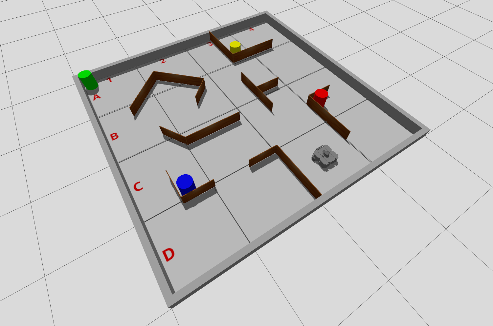
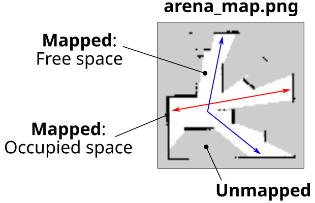

---  
title: "Task 3: Exploration & Search"  
---  

Develop ROS node(s) to allow a TurtleBot3 Waffle to autonomously explore as much of the full Computer Room 5 robot arena as possible, whilst searching for a beacon and documenting its exploration with a map of the environment as it goes! 

!!! success "Course Checkpoints"
    
    * You should have completed **Parts 1-6 of Assignment #1 ^^in full^^** to support your work here. 

    * **[Understanding the Waffles](../../../waffles/essentials.md)** is *also* essential to your success in this task, so make sure you have considered **ALL** of the folllowing: 
    
        * [ ] [Motion and Velocity Control](../../../waffles/essentials.md#motion-and-velocity-control)
        * [ ] [Laser Displacement Readings and the LiDAR Sensor](../../../waffles/essentials.md#laser-displacement-readings-and-the-lidar-sensor)
        * [ ] [The Camera and Image Processing](../../../waffles/essentials.md#the-camera-and-image-processing)

    * You will also need to consider some of [the **Advanced Launch File Concepts** discussed here](../../../course/extras/launch-files.md).

## Summary

This task builds on what you did for Task 2. This time however, your robot will need to navigate a more densely populated arena (i.e. more obstacles), so there'll be less room to navigate freely, and more chance of collisions occurring! Once again, the main aim is to *safely* explore as much of the arena as possible, but with a bit more time to do so now. At the same time, you'll need to search for a beacon of a particular colour and try to capture an image of it. Finally, you'll *also* need to document your robot's exploration by building a map of the environment (with SLAM) as it explores, and save this map for us to view afterwards.

## Details

### The Environment 

You've become very familiar with the Computer Room 5 Robot Arena by now, and you will be exploring this once more! Here's what to expect for Task 3: 

<a name="t3-arena-layout"></a>

<center>*Real arena image coming soon, but here's an example in simulation for now (to illustrate the nature of the task).*</center>

<figure markdown>
  {width=700px}
  <figcaption>An <strong>example</strong> arena layout for Task 3.</figcaption>
</figure>

<a name="env-vars"></a>

**The above is just an example of what the real arena might look like**, but what we can say is this: 

* The arena will contain various wooden walls 180 mm tall, 10 mm thick and 440 mm *or* 880 mm in length (a combination of both lengths will be present).
* Walls will be assembled together *at least* in pairs (since they can't stand up on their own!), but a single wall assembly could comprise more than two walls, and any combination of wall lengths.
* The location and orientation of wall assemblies, as well as the relative angles between walls within each assembly will vary. 
* Walls and/or wall assemblies could also vary in quantity slightly too (there might be a few more, there might be a few less).
* The arena will always contain **four** cylindrical beacons of 200 mm diameter and 250 mm height, each of a different colour: one **yellow**, one **red**, one **green** and one **blue**.
* The beacons could also be located *anywhere* in the arena.
* "Corridors" in the arena (i.e. the free spaces for the robot to explore) will always be sufficient for a robot to pass through with some clearance. You should anticipate some *very* small gaps to be present however between adjacent walls in wall assemblies for example (due to the hinges), or the "wedges" that form between a beacon placed up against a wall (like in the example above). Your exploration algorithms will need to be robust to these unavoidable small gaps.
* The robot could start *anywhere* in the arena: any zone, any position within a zone and at any orientation.

### Exploration

1. Your robot will have **3 minutes (180 seconds) in total** to complete this task. 
    
    **Note**: *The timer will start as soon as the robot starts moving within the arena.*

1. The arena floor will be marked out into **16 equal-sized zones** (each 1 m x 1 m square). You will be awarded marks for each of the zones that your robot enters within the time available (excluding the one it starts in).

    **Note**: *Exploration marks only count when the robot's ^^entire body^^ enters the zone.*

1. Your robot will need to successfully explore whilst avoiding contact with *anything* in the environment. 
    
    Any contact the robot makes with the environment is counted as an *"incident."* Once an incident has taken place, we'll move the robot away slightly so that it is free to move again, but after **five** incidents have occurred the assessment will be stopped, regardless of how much time has elapsed.

### Searching for a Beacon

As with the previous 2 tasks, we will launch the ROS node(s) from within your package for this task using `ros2 launch` ([more details below](#launch)). For this one however, we will *also* supply an additional argument when we do this:

``` { .bash .no-copy }
ros2 launch com2009_teamXX_2026 task3.launch.py target_beacon:=COLOUR
```

...where `COLOUR` will be replaced with either `yellow`, `red`, `green` or `blue` (always in lower case). This target colour will be selected randomly. Based on this input, your robot will need to capture an image of the beacon of that colour.

You will therefore need to define your launch file to accommodate the `target_beacon` command-line argument. In addition to this, inside your launch file you'll *also* need to pass the *value* of this to a ROS node within your package, so that the node knows which beacon to actually look for (i.e. the *yellow*, *red*, *green* or *blue* beacon). This kind of launch file functionality wasn't covered in Assignment #1, but [there are some additional resources available to help you with this](#advanced-launch-file-features).

<a name="arg_parsing"></a>

Upon launching your `task3.launch.py` launch file, a Log Message must be generated by one of your ROS nodes to indicate the specified colour for the search task. This log message must be of `INFO` severity (i.e. using a `#!py get_logger().info()` method call), and must be generated within 10 seconds of executing your launch file. The message should be formatted *exactly* as follows:

``` { .txt .no-copy }
TARGET BEACON: Searching for COLOUR.
```

...where `COLOUR` must be replaced with the actual colour that was passed to your `task3.launch.py` file (either `yellow`, `red`, `green` or `blue`).

#### Saving the Image

At the root of your package there must be a directory called `snaps`, and the image must be saved into this directory with the file name: `target_beacon.jpg`, i.e.:

``` { .txt .no-copy }
~/ros2_ws/src/com2009_teamXX_2026/snaps/target_beacon.jpg
```

The image that is saved here must be the *raw image* from the robot's camera, and should not include any filtering that you may have applied in post-processing.

!!! warning "Be aware"
    
    [**Understanding the Waffles**: The Camera and Image Processing](../../../waffles/essentials.md#the-camera-and-image-processing). There are some key things that you should investigate here, such as:
    
    * [ ] The name of the camera image topic on the real robots.
    * [ ] The native resolution of the camera images, and how this might impact any image processing that you do. 

### Mapping the Environment

Marks are also available in Task 3 for using SLAM to generate a map of the environment whilst your robot is exploring, and saving this map to your package directory (as an image).

#### Generating a Map

One of the earliest exercises you did with the Waffles (back in the Week 1 lab!) was to [use SLAM to create a map of the environment](../../../waffles/basics.md#exSlam). You will have also had a go at this in simulation too, in [Part 3 of Assignment #1](../../../course/part3.md#ex5). Notice that you used the same launch file in both cases, but with one subtle difference:

=== "In the Real World"

    ``` { .bash .no-copy }
    ros2 launch tuos_tb3_tools slam.launch.py environment:=real
    ```

=== "In Simulation"

    ``` { .bash .no-copy }
    ros2 launch tuos_tb3_tools slam.launch.py environment:=sim
    ```

... *which one do you think you might need to apply here?!*

#### Saving a Map

Think back to [Assignment #1 Part 3 Exercise 5](../../../course/part3.md#ex5) again now, and how you were able to save a map as an image from the command-line using a `ros2 run` call:

``` { .bash .no-copy }
ros2 run nav2_map_server map_saver_cli -f MAP_NAME
```

It's also possible to do this *programmatically* using the ROS 2 Service framework. Consider [Assignment #1 Part 4 Exercise 6](../../../course/part4.md#ex6) for how this could be done from within one of your Task 3 ROS nodes.

The root of your package directory must contain a directory called `maps`, and the map that your robot generates during exploration must be saved as a `png` image into this directory with the name `arena_map.png`, i.e.:

``` { .txt .no-copy }
~/ros2_ws/src/com2009_teamXX_2026/maps/arena_map.png
```

## Executing Your Code {#launch}

Your team's ROS package must contain a launch file named `task3.launch.py`, such that (for the assessment) we are able to launch all the nodes that you have developed for this task via the following command:
  
```bash
ros2 launch com2009_teamXX_2026 task3.launch.py target_beacon:=COLOUR
```
... where `XX` will be replaced with your team number and `COLOUR` will be replaced with either `yellow`, `red`, `green` or `blue`.

!!! note
    ROS will already be running on the robot before we attempt to execute your launch file, and [a *Zenoh Session* will be running on the laptop, to allow nodes running on the laptop to communicate with it](../../../waffles/launching-ros.md#step4).

### Advanced Launch File Features

As discussed above, you'll need to be able to do some slightly more advanced things with launch files for this task, such as:

* Accepting command-line arguments.
* Passing command-line arguments to ROS nodes.
* Launching other launch files and passing launch arguments to these too, to configure their behaviour.

All of this is covered in additional section of the ROS 2 Course, see here:

<center>[:material-file: Launch Files (Advanced)](../../../course/extras/launch-files.md){ .md-button target="_blank"}</center>

## Dependencies

You may draw upon pre-existing Python libraries or ROS 2 packages in your own work for Assignment #2, but **there are restrictions that you must be aware of**. [See here for more details on this](../assessment.md#dependencies).

## Marking

There are **40 marks** available for this task in total, awarded based on the criteria outlined below.

<center>

| Criteria | Marks | Details |
| :--- | :---: | :--- |
| **A**: Exploration | 15/40 | For this task, the arena will be divided into **sixteen** equal-sized zones. You will be awarded 1 mark for each zone that your robot manages to enter, excluding the one it starts within. The robot only needs to enter each zone once, but **its full body must be inside the zone marking** to be awarded the associated mark. |
| **B**: An *'incident-free run'* | 5/40 | If your robot completes the task (or the 180 seconds elapses) without it making contact with anything in the arena then you will be awarded full marks here for an *incident-free-run!* You will however be deducted 1 mark per unique "incident" that occurs during the assessment. Your robot must *at least* leave the zone that it starts in to be eligible for these marks and once five incidents have been recorded in total then the assessment will be stopped. |
| **C**: Searching for a Beacon | 15/40 | [Further details below](#crit-c). |
| **D**: Mapping the Environment | 5/40 | [Further details below](#crit-d). | 

</center>

### C: Searching for a Beacon {#crit-c}

There are **15 marks** available for Criterion C.

<center>

| Criteria | Details | Marks|
| :--- | :--- | :--- |
| **C1** | Upon launching your `task3.launch.py` launch file, a Log Message must be generated by one of your ROS nodes to indicate the **correct** target colour for the search task. This Log Message must occur within 10 seconds of executing your launch file, be [of the format specified here](#arg_parsing), and must be achieved using a `#!py get_logger().info()` method call. | 2 |
| **C2** | At the end of the assessment a **single** image file called `target_beacon.jpg` must have been obtained from the robot's camera (during the course of the assessment). This must be located in a folder called `snaps` at the root of your package directory: `~/ros2_ws/src/com2009_teamXX_2026/snaps/target_beacon.jpg`. | 2 | 
| **C3** | Your `target_beacon.jpg` image file (at the path stated above) contains **any part** of the **correct** beacon. | 3 |
| **C4** | Your `target_beacon.jpg` image file (at the path stated above) has captured the **full width** of the correct beacon. | 3 |
| **C5** | Your `target_beacon.jpg` image file (at the path stated above) has captured the **full width** and **full height** of the correct beacon, and the beacon is **entirely unobscured**. | 5 |

</center>

### D: Mapping the Environment {#crit-d}  

There are **5 marks** available for Criterion D.

<center>

| Criteria | Details | Marks|
| :--- | :--- | :--- |
| **D1** | A map of **any part** of the robot arena (however small) must have been generated *during the assessment*. By the end of the assessment, two files should exist: a `png` and a `yaml`, both of which must be called `arena_map`, and both must be located in a `maps` folder at the root of your package directory: `~/ros2_ws/src/com2009_teamXX_2026/maps/arena_map.png` and `~/ros2_ws/src/com2009_teamXX_2026/maps/arena_map.yaml`. | 2 |
| **D2** | Your `arena_map.png` file (created during the assessment and at the path stated above) depicts all free/occupied space extending from any one of the outer arena walls to the opposing outer arena wall, uninterrupted (i.e. containing no unmapped regions), across any part of the arena, to a width of at least 0.5 meters. For example, *either* the red or blue strips in the example map below would do the job:<br /><br />| 3 |   

</center>

## Simulation Resources

As with Tasks 1 & 2, there's a simulation that you can use to develop and test out your team's code against.

!!! warning "Remember"
    
    * Just because it works in simulation **DOESN'T** mean it will work equally well in the real world!
    * Make sure you test things out ^^thoroughly^^ on the real robots during the lab sessions.

You can launch the simulation from the `tuos_task_sims` package with the following `ros2 launch` command:

```bash
ros2 launch tuos_task_sims explore.launch.py
```

<figure markdown>
  {width=700px}
</figure>

Make sure you [check for updates to the course repo](../../../course/extras/course-repo.md#updating) to ensure that you have the most up-to-date version of this.

Once again, this is just an *example* of what the real-world environment *could* look like. See the notes above for [the various ways the environment will vary when this task is assessed in the real robot arena](#env-vars). 

In addition to this, note that beacons will be the same shape, size and colour as those in the simulation, **but** detecting colours is a lot harder in the real-world than it is in simulation, so you'll need to do a lot of real-world testing in order to get this working robustly on the real thing (you will have access to all the beacons during the lab sessions).
