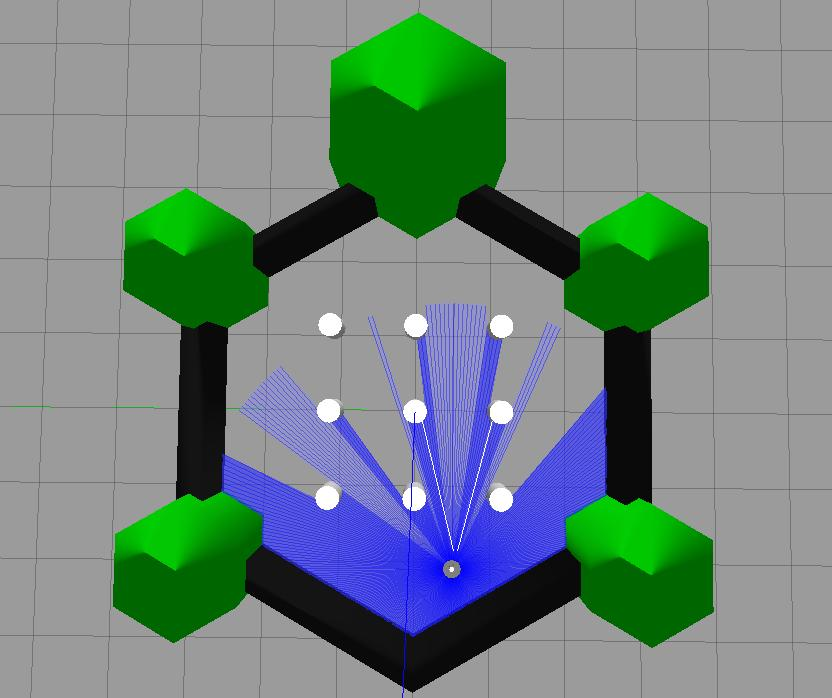
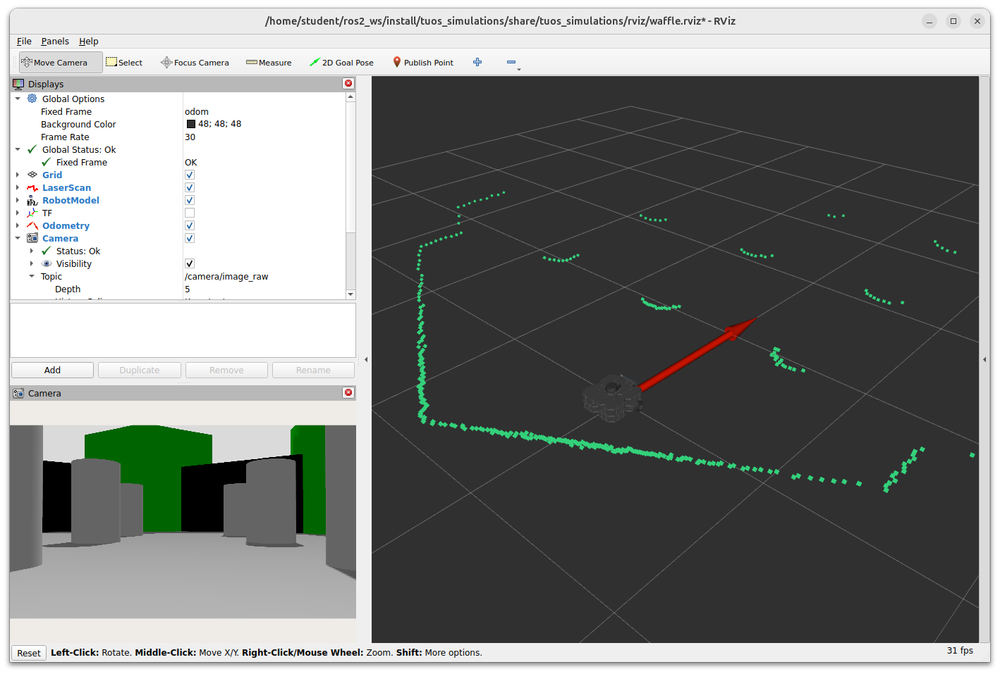

---  
title: "Part 3: Beyond the Basics"  
---

## Introduction


### Aims


### Intended Learning Outcomes


### Quick Links


### Additional Resources


## Getting Started

**Step 1: Launch your ROS Environment**

If you haven't done so already, launch your ROS environment now:

1. **Using WSL-ROS on a university managed desktop machine**: follow [the instructions here to launch it (TODO)]().
1. **[Running WSL-ROS on your own machine (TODO)]()**: launch the Windows Terminal to access a WSL-ROS terminal instance.
1. **Other Users**: Launch a terminal instance with access to your local ROS installation.

You should now have access to a Linux terminal instance, and we'll refer to this terminal instance as **TERMINAL 1**.

**Step 2: Restore your work (WSL-ROS Managed Desktop Users ONLY)**

Remember that any work that you do within the WSL-ROS Environment will not be preserved between sessions or across different University computers. At [the end of Part 2](./part2.md#backup) you should have run the `wsl_ros` tool to back up your home directory to your University `U:\` Drive. Once WSL-ROS is up and running, you should be prompted to restore this:

<figure markdown>
  TODO
</figure>

Enter `Y` to restore your work from last time. You can also restore your work at any time using the following command:

```bash
wsl_ros restore
```

**Step 3: Launch VS Code**  

It's also worth launching VS Code now, so that it's ready to go for when you need it later on. 

!!! warning "WSL Users..."
        
    It's important to launch VS Code within your ROS environment using the "WSL" extension. Always remember to check for this: FIG TODO

**Step 4: Make Sure The Course Repo is Up-To-Date**

In Part 1 you should have [downloaded and installed The Course Repo](./part1.md#course-repo) into your ROS environment. Hopefully you've done this by now, but if you haven't then go back and do it now (you'll need it for some exercises here). If you *have* already done it, then (once again) it's worth just making sure it's all up-to-date, so run the following command now to do so:

***
**TERMINAL 1:**
```bash
cd ~/ros2_ws/src/tuos_ros/ && git pull
```

Then run `colcon build` 

```bash
cd ~/ros2_ws/ && colcon build --packages-up-to tuos_ros
```

And finally, re-source your environment:

```bash
source ~/.bashrc
```
***

!!! warning "Remember"
    If you have any other terminal instances open, then you'll need run `source ~/.bashrc` in these too, in order for the changes to propagate through to these as well!

## Launch Files

So far (in Parts 1 & 2) we've used the `ros2 run` command to execute a variety of ROS nodes, such as `teleop_keyboard`, as well as a number of nodes that we've created of our own. You may also have noticed that we've used a `ros2 launch` command now and again too, mainly to launch Gazebo Simulations of our robot, but why do we have these two commands, and what's the difference between them?

Complex ROS applications typically require the execution of multiple nodes at the same time. The `ros2 run` command only allows us to execute a single node, and so this isn't that convenient for such complex applications, where we'd have to open multiple terminals, use `ros2 run` multiple times *and* make sure that we ran everything in the correct order without forgetting anything! `ros2 launch`, on the other hand, provides a means to launch multiple ROS nodes *simultaneously* by defining exactly what we want to launch within *launch files*. This makes the execution of complex applications more reliable, repeatable and easier for others to launch these applications correctly. 

#### :material-pen: Exercise 1: Creating a Launch File {#ex1}

In order to see how launch files work, let's create some of our own!

In Part 1 we created `publisher.py` and `subscriber.py` nodes that could talk to one another via a topic called `/my_topic`. We launched these independently using the `ros2 run` command in two separate terminals. Wouldn't it be nice if we could have launched them both at the same time, from the *same terminal* instead?

To start with, let's create another new package, this time called `part3_beyond_basics`. 

1. In **TERMINAL 1**...
    
    1. Head to the `src` folder of your ROS workspace, and into the `tuos_ros` Course Repo from there:

        ***
        **TERMINAL 1:**
        ```bash
        cd ~/ros2_ws/src/tuos_ros/
        ```
       
    1. Use the `create_pkg.sh` helper script to create a new package once again:

        ```bash
        ./create_pkg.sh part3_beyond_basics
        ```
    
    1. And navigate into the *root* of this new package, using `cd`:

        ```bash
        cd ../part3_beyond_basics/
        ```
        ***

1. Launch files should be located in a `launch` directory at the root of the package directory, so use `mkdir` to do this:

    ***
    **TERMINAL 1:**
    ```bash
    mkdir launch
    ```
    ***

1. Use the `cd` command to enter the `launch` folder that you just created, then use the `touch` command to create a new empty file called `pubsub.launch.py`.

    ***
    **TERMINAL 1:**
    ```bash
    cd launch && touch pubsub.launch.py
    ```

1. Open this launch file in VS Code and enter the following:

    ```py
    from launch import LaunchDescription
    from launch_ros.actions import Node

    def generate_launch_description():
        return LaunchDescription([
            Node(
                package='part1_pubsub',
                executable='publisher.py',
                name='my_publisher'
            )
        ])
    ```

1. We need to make sure we tell `colcon` about our new `launch` directory, so that it can build the launch files within it when we run `colcon build`. To do this, we need to add a *directory* install instruction to our package's `CMakeLists.txt`:

    Open up the `CMakeLists.txt` file and add the following text **just above** the `ament_package()` line at the very bottom:

    ```txt title="part3_beyond_basics/CMakeLists.txt"
    install(DIRECTORY
      launch
      DESTINATION share/${PROJECT_NAME}
    )
    ```

1. Now, let's build the package... <a name="colcon-build"></a>

    1. Navigate back to the root of the ROS workspace:

        ***
        **TERMINAL 1:**
        ```bash
        cd ~/ros2_ws/
        ```
    
    1. Run `colcon build` on your new package *only*:

        ```bash
        colcon build --packages-select part3_beyond_basics
        ``` 

    1. And finally, re-source the `.bashrc`:

        ```bash
        source ~/.bashrc
        ```
        ***

1. Use `ros2 launch` to launch this file and test it out as it is:

    ***
    **TERMINAL 1:**
    ```bash
    ros2 launch part3_beyond_basics pubsub.launch.py
    ```
    ***
    
1. The code that we've given you above will launch the `publisher.py` node from the `part1_pubsub` package, but not the `subscriber.py` node.  We therefore need to add another `Node()` object to our `LaunchDescription`:

    ```py
    from launch import LaunchDescription
    from launch_ros.actions import Node

    def generate_launch_description():
        return LaunchDescription([
            Node(
                package='part1_pubsub',
                executable='publisher.py',
                name='my_publisher'
            ),
            Node(
                # TODO
            )
        ])
    ```

    Using the same methods as above, and the necessary definitions for the `subscriber.py` node into your launch file.

1. Once you've made these changes [you'll need to run `colcon build` again](#colcon-build).

    !!! warning

        You'll need to run `colcon build` *every time* you make changes to a launch file, even if you use the `--symlink-install` option (as this only applies to nodes in the `scripts` directory)
        
1. Once you've completed this, it should be possible to launch both the publisher and subscriber nodes with `ros2 launch` and the `pubsub.launch.py` file. Verify this in **TERMINAL 1** by executing the launch file. Soon after launching this, you should see the following messages to indicate that both nodes are alive:

    ``` { .txt .no-copy }
    [subscriber.py-2] [INFO] [###] [my_subscriber]: The 'my_subscriber' node is initialised.
    [publisher.py-1] [INFO] [###] [my_publisher]: The 'my_publisher' node is initialised.
    ```

    ... and following this, the outputs of both nodes should be printed to the screen continually:

    ``` { .txt .no-copy }
    [publisher.py-1] [INFO] [###] [my_publisher]: Publishing: 'The ROS time is 1737545960 (seconds).'
    [subscriber.py-2] [INFO] [###] [my_subscriber]: The 'my_subscriber' node heard:
    [subscriber.py-2] [INFO] [###] [my_subscriber]: 'The ROS time is 1737545960 (seconds).' 
    ```

1. We can further verify this in a new terminal (**TERMINAL 2**), using commands that we've use in Parts 1 & 2 to *list* all nodes and topics that are active on our ROS network:

    ***
    **TERMINAL 2:**

    ```bash
    ros2 node list
    ```
    ```bash
    ros2 topic list
    ```

    Do you see what you'd expect to see in the output of these two commands?

    ***

    

The attributes here have the following meaning:

* `pkg`: The name of the *ROS package* containing the functionality that we want to launch.
* `type`: The full name of the script (i.e. *ROS Node*) that we want to execute within that package (including the file extension, if it has one).
* `name`: A descriptive name that we want to give to the ROS node, which will be used to register it on the ROS Network.
* `output`: The place where any output from the node will be printed (either *screen* where the output will be printed to our terminal window, or *log* where the output will be printed to a log file).


## Laser Displacement Data and The LiDAR Sensor {#lidar}

As you'll know from Part 2, odometry is really important for robot navigation, but it can be subject to drift and accumulated error over time. You may have observed this in simulation during [Part 2 Exercise 5](./part2.md#ex5), and you would most certainly notice it if you were to do the same on a real robot. Fortunately, The Waffles have another sensor on-board which provides even richer information about the environment, and we can use this to supplement the odometry information and enhance the robot's navigation capabilities.

#### :material-pen: Exercise 1: Using RViz to Visualise LaserScan Data {#ex1}

<a name="rviz"></a>We're now going to place the robot in a more interesting environment than the "empty world" we've used in the previous parts of this course so far...

1. In **TERMINAL 1** enter the following command to launch this:

    ***
    **TERMINAL 1:**
    ```bash
    ros2 launch turtlebot3_gazebo turtlebot3_world.launch.py
    ```
    ***

    A Gazebo simulation should now be launched with a TurtleBot3 Waffle in a new environment:

    <figure markdown>
      {width=600px}
    </figure>

1. Open a new terminal instance (**TERMINAL 2**) and enter the following:

    ***
    **TERMINAL 2:**
    ```bash
    ros2 launch tuos_simulations rviz.launch.py
    ```
    ***
    
    On running the command a new window should open:

    <figure markdown>
      {width=600px}
    </figure>

    This is *RViz*, which is a ROS tool that allows us to *visualise* the data being measured by a robot in real-time. 
    
    The green dots scattered around the robot represent *laser displacement data* which is measured by the LiDAR sensor located on the top of the robot, allowing it to measure the *distance* to any obstacles in its surroundings. 
    
    The LiDAR sensor spins continuously, sending out laser pulses as it does so. These laser pulses are reflected from any objects and sent back to the sensor. Distance can then be determined based on the time it takes for the pulses to complete the full journey (from the sensor, to the object, and back again), by a process called *"time of flight"*. Because the LiDAR sensor spins and performs this process continuously, a full 360&deg; scan of the environment can be generated.
    
    In this case (because we are working in simulation here) the data represents the objects surrounding the robot in its *simulated environment*, so you should notice that the green dots produce an outline that resembles the objects in the world that is being simulated in Gazebo (or partially at least).
    
1. Next, open up a new terminal instance (**TERMINAL 3**). Laser displacement data from the LiDAR sensor is published by the robot to the `/scan` topic. We can use the `ros2 topic info` command to find out more about the nodes that are publishing and subscribing to this topic, as well as the *type of interface* used to transmit this topic data:

    ***
    **TERMINAL 3:**
    ```bash
    ros2 topic info /scan
    ```
    ```{ .txt .no-copy }
    Type: sensor_msgs/msg/LaserScan
    Publisher count: 1
    Subscription count: 0
    ```
    ***

1. As we can see from above, `/scan` data is of the `sensor_msgs/msg/LaserScan` type, and we can find out more about this interface using the `ros2 interface show` command:

    ***
    **TERMINAL 3:**
    ```bash
    ros2 interface show sensor_msgs/msg/LaserScan
    ```
    ```{ .txt .no-copy }
    # Single scan from a planar laser range-finder

    std_msgs/Header header # timestamp in the header is the acquisition time of
            builtin_interfaces/Time stamp
                    int32 sec
                    uint32 nanosec
            string frame_id
                                 # the first ray in the scan.
                                 #
                                 # in frame frame_id, angles are measured around
                                 # the positive Z axis (counterclockwise, if Z is up)
                                 # with zero angle being forward along the x axis

    float32 angle_min            # start angle of the scan [rad]
    float32 angle_max            # end angle of the scan [rad]
    float32 angle_increment      # angular distance between measurements [rad]

    float32 time_increment       # time between measurements [seconds] - if your scanner
                                 # is moving, this will be used in interpolating position
                                 # of 3d points
    float32 scan_time            # time between scans [seconds]

    float32 range_min            # minimum range value [m]
    float32 range_max            # maximum range value [m]

    float32[] ranges             # range data [m]
                                 # (Note: values < range_min or > range_max should be discarded)
    float32[] intensities        # intensity data [device-specific units].  If your
                                 # device does not provide intensities, please leave
                                 # the array empty.
    ```
    ***

### Interpreting LaserScan Data

The `LaserScan` interface is a standardised ROS message interface (from the `sensor_msgs` package) that any ROS Robot can use to publish data that it obtains from a Laser Displacement Sensor such as the LiDAR on the TurtleBot3.  

`ranges` is an array of `float32` values (array data-types are suffixed with `[]`). This is the part of the message containing all the *actual distance measurements* that are being obtained by the LiDAR sensor (in meters).

<a name="fig_lidar"></a>Consider a simplified example here, taken from a TurtleBot3 robot in a much smaller, fully enclosed environment:

<figure markdown>
  
</figure>

<a name="echo_scan_variables"></a>As illustrated in the figure, we can associate each data-point of the `ranges` array to an *angular position* by using the `angle_min`, `angle_max` and `angle_increment` values that are also provided within the `LaserScan` message.  We can use the `ros2 topic echo` command to find out what their values are:

```{ .txt .no-copy }
$ ros2 topic echo /scan --field angle_min --once
0.0
---
```
```{ .txt .no-copy }
$ ros2 topic echo /scan --field angle_max --once
6.28000020980835
---
```
```{ .txt .no-copy }
$ ros2 topic echo /scan --field angle_increment --once
0.01749303564429283
---
```

!!! question
    * What do these values represent? (Compare them with [the figure above](#fig_lidar))

!!! tip 
    Notice how we were able to access *specific variables* within the `/scan` data using the `--field` flag, and ask the command to only provide us with a single message by using `--once`?

The `ranges` array contains 360 values in total, i.e. a distance measurement at every 1&deg; (an `angle_increment` of 0.0175 radians) around the robot. The first value in the `ranges` array (`ranges[0]`) is the distance to the nearest object directly in front of the robot (i.e. at &theta; = 0 radians, or `angle_min`). The last value in the `ranges` array (`ranges[359]`) is the distance to the nearest object at 359&deg; (i.e. &theta; = 6.283 radians, or `angle_max`) from the front of the robot, i.e.: 1 degree to the *right* of the X-axis. `ranges[65]`, for example, would represent the distance to the closest object at an angle of 65&deg; (1.138 radians) from the front of the robot (*anti-clockwise*), as shown in [the figure](#fig_lidar).

<a name="range_max_min"></a>The `LaserScan` message also contains the parameters `range_min` and `range_max`, which represent the *minimum* and *maximum* distance (in meters) that the LiDAR sensor can detect, respectively. Use the `ros2 topic echo` command to report these directly too.  

!!! question "Questions"
    1. What *is* the maximum and minimum range of the LiDAR sensor? Use [the same technique as we used above](#echo_scan_variables) to find out.
    1. Did you notice what was noted against `ranges` in the `ros2 interface show` output earlier:

        ``` { .txt .no-copy }
        float32[] ranges    # range data [m]
                            # (Note: values < range_min or > range_max should be discarded)
        ```

        (this might be worth noting).

Finally, use the `ros2 topic echo` command again to display the `ranges` portion of the `LaserScan` data. There's a lot of data here (360 data points per message in fact, as you know from above!):

```txt
ros2 topic echo /scan --field ranges
```

We're dropping the `--once` option now, so that we can see the data points updating in real-time.  You might need to expand the terminal window so that you can see all the data points; data will be bound by square brackets `[]`, and there should be a `---` at the end of each message too, to help you confirm that you are viewing the whole thing.

The main thing you'll notice here is that there's lots of information, and it changes rapidly! As you have already seen though, it is the numbers that are flying by here that are represented by red dots in RViz.  Head back to the RViz screen to have another look at this now. As you'll no doubt agree, this is a much more useful way to visualise the `ranges` data, and illustrates how useful RViz can be for interpreting what your robot can *see* in real-time.

What you may also notice is several `inf` values scattered around the array.  These represent sensor readings that are outside the sensor's measurement range (i.e. *greater than* `range_max` or *less than* `range_min`), so the sensor can't report a distance measurement in such cases. Remember the comment above: 

``` { .txt .no-copy }
(Note: values < range_min or > range_max should be discarded)
```

!!! note
    This behaviour is different on the real robots! **Be aware of this when developing code for real robots**!!

Stop the `ros2 topic echo` command from running in the terminal window by entering ++ctrl+c++ in **TERMINAL 3**. Also close down the RViz process running in **TERMINAL 2** now as well. 

#### :material-pen: Exercise 2: Building a Basic LaserScan Callback Function {#ex2}

LaserScan data presents us with a new challenge: processing reasonably large datasets. In this exercise we'll look at some basic approaches that can be taken to deal with this data, and get something meaningful out of it that can be used in your robot applications.

<!-- We'll need to create a new package again, so let's do this first (in **TERMINAL 2**).

1. Head to the `src` folder of your ROS workspace into the `tuos_ros` Course Repo from there:

    ```bash
    cd ~/ros2_ws/src/tuos_ros/
    ```

1. Use the `create_pkg.sh` helper script to create a new package called `part3_lidar_etc`:

    ```bash
    ./create_pkg.sh part3_lidar_etc
    ``` -->

1. Then navigate into the `scripts` folder of the new package using the `cd` command again:

    ```bash
    cd ../part3_lidar_etc/scripts/
    ```

1. This will once again be a subscriber node at it's core, building on the same basic structure that we've used for similar nodes in Parts 1 and 2. 
    
    As a starting point, create a new file called `lidar_subscriber.py`:
    
    ```bash
    touch lidar_subscriber.py
    ``` 

    and give this *execute* permissions:

    ```bash
    chmod +x lidar_subscriber.py
    ```

1. Declare this as a package executable by opening up your package's `CMakeLists.txt` in VS Code, and replacing `minimal_node.py` with `lidar_subscriber.py` as shown below:

    ```txt title="CMakeLists.txt"
    # Install Python executables
    install(PROGRAMS
      scripts/lidar_subscriber.py
      DESTINATION lib/${PROJECT_NAME}
    )
    ```

1. Then, you'll need to add some new dependencies to your package's `package.xml` file, so open this up in VS Code too. Below the `#!xml <exec_depend>rclpy</exec_depend>` line, add the following:

    ```xml title="package.xml"
    <exec_depend>rclpy</exec_depend>
    <exec_depend>sensor_msgs</exec_depend>
    <exec_depend>python3-numpy</exec_depend>
    ```

1. Head back to the terminal and use Colcon to build this new package, along with the `lidar_subscriber.py` node (even though it's still just an empty file at this stage):

    ```bash
    cd ~/ros2_ws/ && colcon build --packages-select part3_lidar_etc --symlink-install
    ```

    And after that, re-source your `.bashrc`:

    ```bash
    source /.bashrc
    ```

1. Right, with all of that out of the way, it's time to start building the `lidar_subscriber.py` Python Node! Open up the file in VS Code, then [follow the steps here](./part3/lidar_subscriber.md) to construct it. <a name="ex2_ret"></a>

1. Once you're happy with what's going on with this, run the node using `ros2 run`:

    ```bash
    ros2 run part3_lidar_etc lidar_subscriber.py
    ```

1. Open another terminal (but so you can still the outputs from your `lidar_subscriber.py` node). Launch the `teleop_keyboard` node, and drive the robot around, noting how the output from your `lidar_subscriber.py` node changes as you do so.

1. Close everything down now (including the simulation running in **TERMINAL 1**). Then (in **TERMINAL 1**) launch the "empty world" simulation again:

    ***
    **TERMINAL 1:**
    ```bash
    ros2 launch turtlebot3_gazebo empty_world.launch.py
    ```
    ***

1. Go back to **TERMINAL 2** and launch your `lidar_subscriber.py` node again:

    ***
    **TERMINAL 2:**
    ```bash
    ros2 run part3_lidar_etc lidar_subscriber.py
    ```
    ***

    What output do you see from this now?

#### :material-pen: Exercise 3: Enhancing the LaserScan Callback {#ex3}

In the previous exercise we performed some processing on the LiDAR `ranges` array, specifically:

1. Grab 40 data points to represent all distance readings from a 40&deg; arc ahead of the robot
1. Remove any "out-of-range" values (`inf`)
1. Return the average value from the data points that remain.

As such, we've condensed a LiDAR array subset of 40 data points into a *single* point to represent (approximately) how far away an object is ahead of our robot. 

We could take this approach with other subsets of the `ranges` array too, to observe what's happening in different points around the robot, while still maintaining a manageable number of data points to monitor overall.

Consider the following ...

We can modify this "Empty World" environment with some basic objects, and we can move these around to further investigate how the `lidar_subscriber.py` outputs change under different conditions. 

In the Gazebo simulation window, use the "Box" tool in the top toolbar to place a box in front of the robot:

<!-- 
<figure markdown>
  {width=700px}
</figure> -->

Use the "Scale Mode" button to resize the box and use the "Translation Mode" button to reposition it.

<!-- 
<figure markdown>
  
</figure> -->

Once you are happy with this, right-click on the object and select "Delete" to remove it from the world. 

<!-- 
<figure markdown>
  
</figure> -->