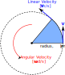

---  
title: "A Simple Velocity Control Node (Move Circle)"
---

## The Initial Code

Start by returning to the `publisher.py` file from your `part1_pubsub` package ([or return here](../part1/publisher.md)), and copy the contents into your new `move_circle.py` file. Then, adapt the code as follows.

## Creating the "Move Circle" Node

### Imports

Once again, `rclpy` and the `Node` class from the `rclpy.node` library are vital for any node we create, so the first two imports will remain the same.

We need to import the message type used by the `/cmd_vel` topic here though, in order to be able to format velocity commands appropriately. We can find all the necessary information about this message type by using the `ros2 topic info` command:

``` { .bash .no-copy }
$ ros2 topic info /cmd_vel
Type: geometry_msgs/msg/TwistStamped
...
```

And so our message import becomes:

```py
from geometry_msgs.msg import TwistStamped # (1)!
```

1. In place of: `#!py from example_interfaces.msg import String`

### Change the Class Name

Previously our publisher class was called `#!python SimplePublisher()`, change this to `#!python Circle`:

```py
class Circle(Node):
```

### Initialising the Class

1. Initialise the node with an appropriate name:

    ```python
    super().__init__("move_circle")
    ```

1. Change the `create_publisher()` parameters:

    ```python
    self.my_publisher = self.create_publisher(
        msg_type=??, # (1)!
        topic=??, # (2)!
        qos_profile=10,
    )
    ```

    1. What is the name of the interface that we are using here?
    2. What's the name of the topic that we want to publish our velocity commands to?

1. We'll need to publish velocity commands at a rate of at least 10 Hz, so define this here, and then set up a timer accordingly:

    ```py
    publish_rate = 10 # Hz
    self.timer = self.create_timer(
        timer_period_sec=1/publish_rate, 
        callback=self.timer_callback
    )
    ```

### Modifying the Timer Callback

Here, we'll publish our velocity commands:

```py
def timer_callback(self):
    radius = 0.5 # meters
    linear_velocity = 0.1 # meters per second [m/s]
    angular_velocity = ?? # radians per second [rad/s] # (1)!

    topic_msg = TwistStamped() # (2)!
    topic_msg.twist.linear.x = linear_velocity
    topic_msg.twist.angular.z = angular_velocity
    self.my_publisher.publish(topic_msg) # (3)!
    
    self.get_logger().info( # (4)!
        f"Linear Velocity: {topic_msg.twist.linear.x:.2f} [m/s], "
        f"Angular Velocity: {topic_msg.twist.angular.z:.2f} [rad/s].",
        throttle_duration_sec=1, # (5)!
    )

```

1. Having defined the radius of the circle, and the *linear* velocity that we want the robot to move at, how would we calculate the *angular* velocity that should be applied?

    Consider the equation for angular velocity:

    <figure markdown>
      {width=200}
    </figure>

    $$
    \omega=\frac{v}{r}
    $$

2. `/cmd_vel` uses `TwistStamped` messages, so we instantiate one here, and assign the linear and angular velocity values (as set above) to the relevant message fields. Remember, [we talked about all this here](../part2.md#velocity-commands).

3. Once the appropriate velocity fields have been set, publish the message.

4. Publish a ROS *Log* Message to inform us (in the terminal) of the velocity control values that are being published by the node.

5. [Remember in the Odometry Subscriber](./odom_subscriber.md#modifying-the-message-callback) how we used a counter (`#!py self.counter`) and an `#!py if()` statement to control the rate at which these log messages were generated?

    We can actually achieve exactly the same thing by simply supplying a `throttle_duration_sec` argument to the `get_logger().info()` call. Much easier, right?

### Updating "Main"

Once again, don't forget to update any relevant parts of the `main` function to ensure that we're instantiating the `Circle()` class, spinning and shutting it down correctly.

## Package Dependencies

Our `move_circle.py` node has a new package import:

```py
from geometry_msgs.msg import TwistStamped
```

Our `part2_navigation` package therefore has a new dependency, so we need to add this to our package's `package.xml` file.

Earlier on we added `nav_msgs` to this (for the `odom_subscriber.py` node). Below this, add a new `#!xml <exec_depend>` for `geometry_msgs`:

```xml title="package.xml"
<exec_depend>rclpy</exec_depend>
<exec_depend>nav_msgs</exec_depend>
<exec_depend>geometry_msgs</exec_depend>  <!-- (1)! -->
```

1. ADD THIS LINE!

Save the file and close it.
