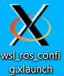
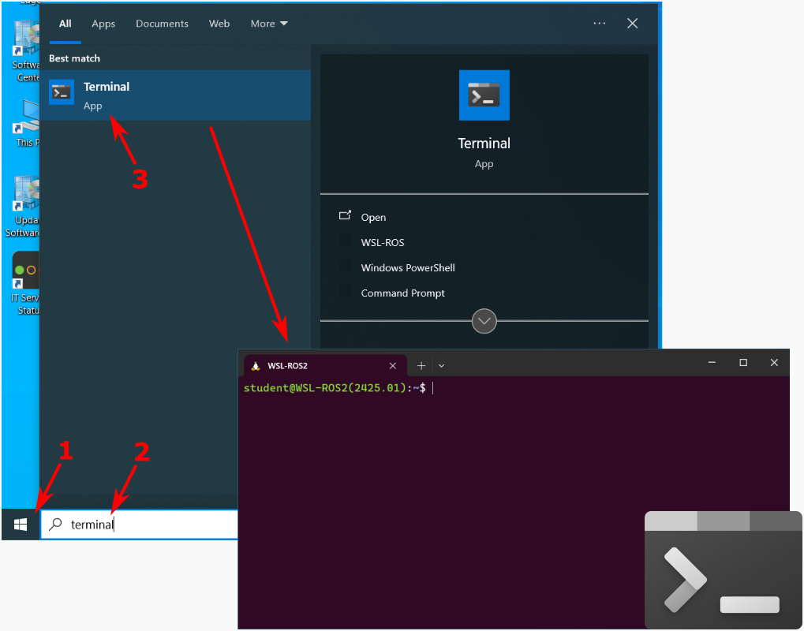
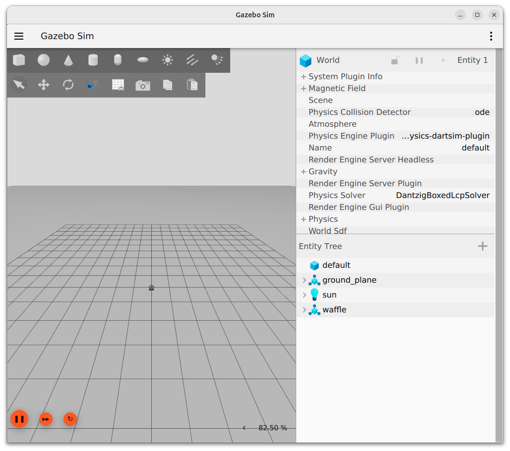

**Applicable to**: Windows 10 or 11 personal (unmanaged) computers

## The WSL-ROS2 Simulation Environment

To support this course we've created a custom ROS 2 environment which runs on Windows 10 or 11 using the [Windows Subsystem for Linux (WSL)](https://docs.microsoft.com/en-us/windows/wsl/){target="_blank"}. We call this "**WSL-ROS2**" and you can download it via the University of Sheffield [Software Download Service](https://www.sheffield.ac.uk/software/){target="_blank"} (University login required).

!!! note
    When you download WSL-ROS2 from the Software Download Service you will receive an email with installation instructions. We recommend that you follow the instructions provided on *this page* instead, as this page will be kept more up-to-date throughout the semester.

## Prerequisites

1. Your computer must be running Windows 10 **Build 19044 or higher**, or Windows 11.
2. [Update the GPU drivers for your machine](https://learn.microsoft.com/en-us/windows/wsl/tutorials/gui-apps#install-support-for-linux-gui-apps){target="_blank"}.
3. Install or update WSL:
    1. If you don't already have WSL installed on your machine then follow [these instructions to install it](https://learn.microsoft.com/en-us/windows/wsl/tutorials/gui-apps#fresh-install---no-prior-wsl-installation){target="_blank"}.
    2. If you *do* already have WSL installed on your machine, then follow [these instructions to update it](https://learn.microsoft.com/en-us/windows/wsl/tutorials/gui-apps#existing-wsl-install){target="_blank"}.
4. [Install the Windows Terminal](https://learn.microsoft.com/en-us/windows/terminal/install){target="_blank"}.
5. [Install Visual Studio Code](https://code.visualstudio.com/){target="_blank"} and [the WSL VS Code extension](https://marketplace.visualstudio.com/items?itemName=ms-vscode-remote.remote-wsl){target="_blank"}.
1. Install the [VcXsrv Windows X Server](https://sourceforge.net/projects/vcxsrv/){target="_blank"}.

## Installing

1. Go to the [IT Services Software Downloads](https://www.sheffield.ac.uk/software/){target="_blank"} page (you'll need to log in with your university MUSE credentials).
2. Scroll down to the bottom, where you should see WSL-ROS listed.
    
    Click on the blue "Request WSL-ROS" button and then wait to receive an email to your university email address.

3. The email will contain a link to download **WSL-ROS2** to your machine as a `.zip` file (~2 GB).
    
4. On your computer, create a new folder in the root of your `C:\` drive called `WSL-ROS2`.
5. Extract the content of the downloaded `.zip` file into to the `C:\WSL-ROS2\` folder.
6. Launch PowerShell and enter the follow command to install WSL-ROS2 as a WSL distro on your machine:

    ```powershell
    wsl --import WSL-ROS2 $env:localappdata\WSL-ROS2 `
    C:\WSL-ROS2\wsl-ros2-v2526.01.tar --version 2
    ```

7. This may take a couple of minutes. Once it's done, you can verify that it was successful with the following command:

    ```powershell
    wsl -l -v
    ```

    Where `WSL-ROS2` should be listed.

8. Next (**optional**), open up the Windows Terminal App, then:
    
    1. Go to Settings (++ctrl+comma++)
    1. In `Startup` > `Default profile` select **WSL-ROS2** from the drop-down list.

    *Alternatively*, you could always use our own Windows Terminal Settings file (but note that this will overwrite any of your own custom Windows Terminal App settings, if you have any):

    ```powershell
    Copy-Item -Path C:\WSL-ROS2\settings.json -Destination `
    $env:localappdata\Packages\Microsoft.WindowsTerminal_8wekyb3d8bbwe\LocalState
    ```

    Either way, this will ensure that each time you open the Windows Terminal App *or* you press the New Tab (:material-plus:) button a WSL-ROS2 Terminal Instance will be launched by default.


<!-- ## Initial Setup

With your WSL-ROS2 terminal instance, you'll need to run some initial commands to get things set up.

1. First, update the distro:

    ```bash
    sudo apt update && sudo apt upgrade -y
    ```

1. Next, run the following command to attempt to use native Graphical User Interface (GUI) support (which should work if you followed all [the prerequisites above](#prerequisites)):

    ```bash
    echo "export XSERVER=false" > $HOME/.diamond/xserver.sh
    ```

1. Re-source your `.bashrc` file for this change to take effect:

    ```bash
    source ~/.bashrc
    ```

1. Run the following ROS command to see if you can launch the Gazebo GUI, which is crucial for this course:

    ```bash
    ros2 launch turtlebot3_gazebo empty_world.launch.py
    ```

    

    If this doesn't work, or if performance is poor then you may need to try using a dedicated X Server (VcXsrv) instead...  -->

## Using a Dedicated X Server

WSL-ROS2 requires an XServer in order to render graphical applications (such as Gazebo and RViz)[^wsl-native-guis]. You need to make sure you have one up and running whenever you're working with WSL-ROS2.

[^wsl-native-guis]: WSL2 does support GUI applications natively, however we are finding that the latest version of Gazebo (Ignition) doesn't seem to play nicely with this, and performance is generally pretty poor. Using a dedicated XServer seems to offer marginally better performance. 

1. First, download this [config file for VcXsrv](https://drive.google.com/file/d/1CMJZ6xVXJ2cKZ0NmdYaxUw9RfPsIGLX9/view?usp=sharing){target="_blank"} and save it to your desktop as `wsl_ros_config.xlaunch`.

    <figure markdown>
      
    </figure>

1. Double click this to launch VcXsrv with the appropriate settings. An icon should then appear in your notification tray (bottom-right) to indicate that the X Server is running:
    
    <figure markdown>
      {width=25px}
    </figure>

1. Launch the WSL-ROS2 environment by launching the Windows Terminal App:

    <figure markdown>
      {width=700px}
    </figure>

1. In the WSL-ROS2 terminal instance, try running the empty world Gazebo simulation:

    ```bash
    ros2 launch turtlebot3_gazebo empty_world.launch.py
    ```

    This should hopefully present you with something like this:

    <figure markdown>
      {width=600px}
    </figure>

    !!! warning "Important"
        You need to make sure you have the X Server running (by clicking the `wsl_ros_config.xlaunch` shortcut) **every time** you work with WSL-ROS2. 


<!-- ## Hardware Acceleration

!!! note
    Only a (potential) option for those who **aren't** using [VcXsrv](#using-a-dedicated-x-server), and even then, it's not guaranteed that it'll work for everyone!

1. If your graphics card supports it, it **may** be possible to also use hardware acceleration for GUI apps. If you want to try this, then run the following command to enable this:

    ```bash
    echo "export LIBGL_ALWAYS_SOFTWARE=false" >> $HOME/.bashrc
    ```

    Then - once again - re-source your `.bashrc` file for this change to take effect:

    ```bash
    source ~/.bashrc
    ``` -->

## See Also

* [Setting up VS Code for WSL](./using-wsl-ros/vscode.md)
* [A Quick Introduction to the Linux Terminal](./using-wsl-ros/linux-term.md)
