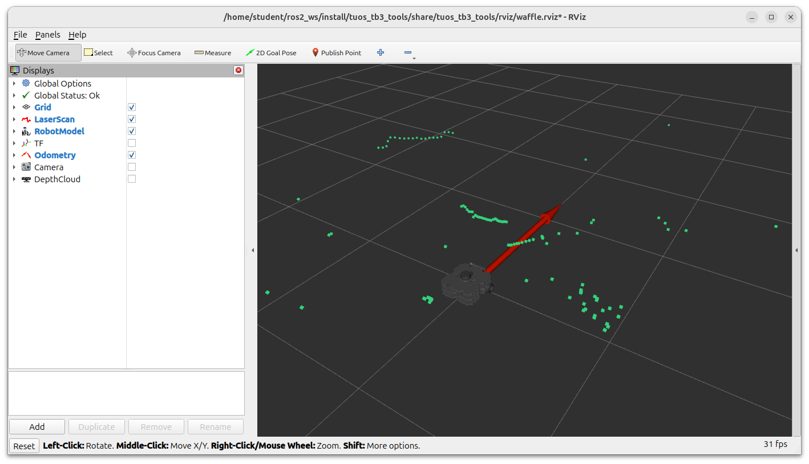
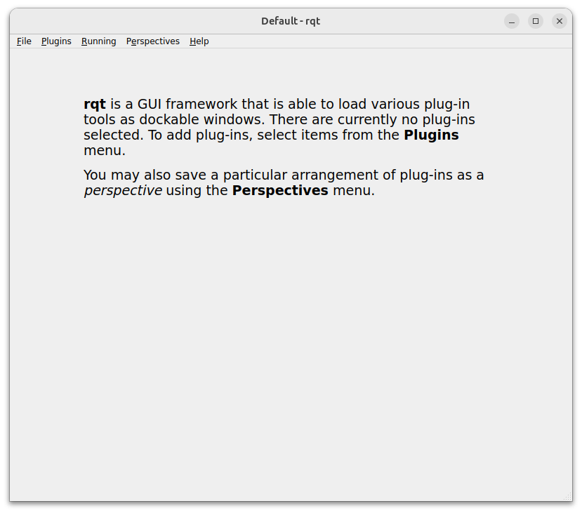
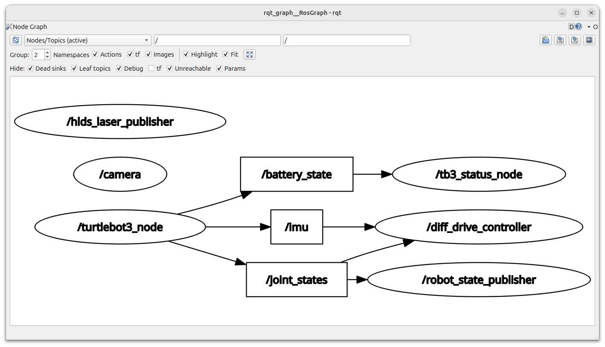
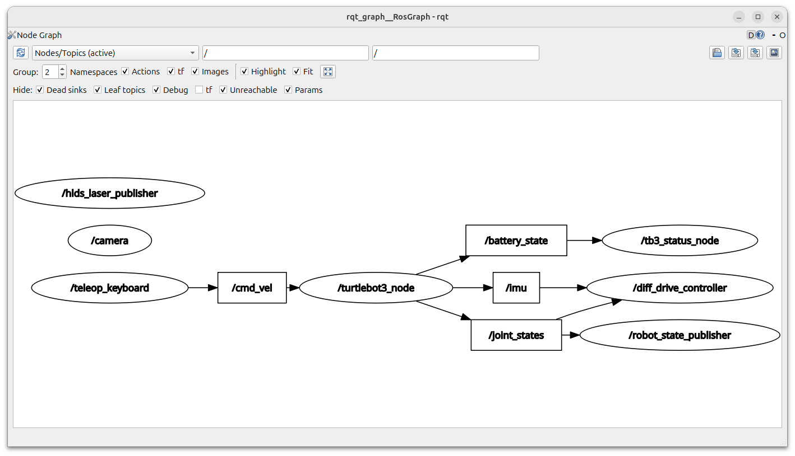
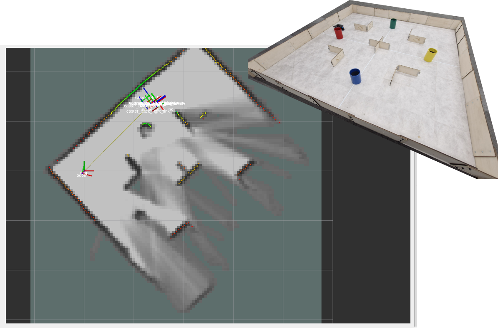
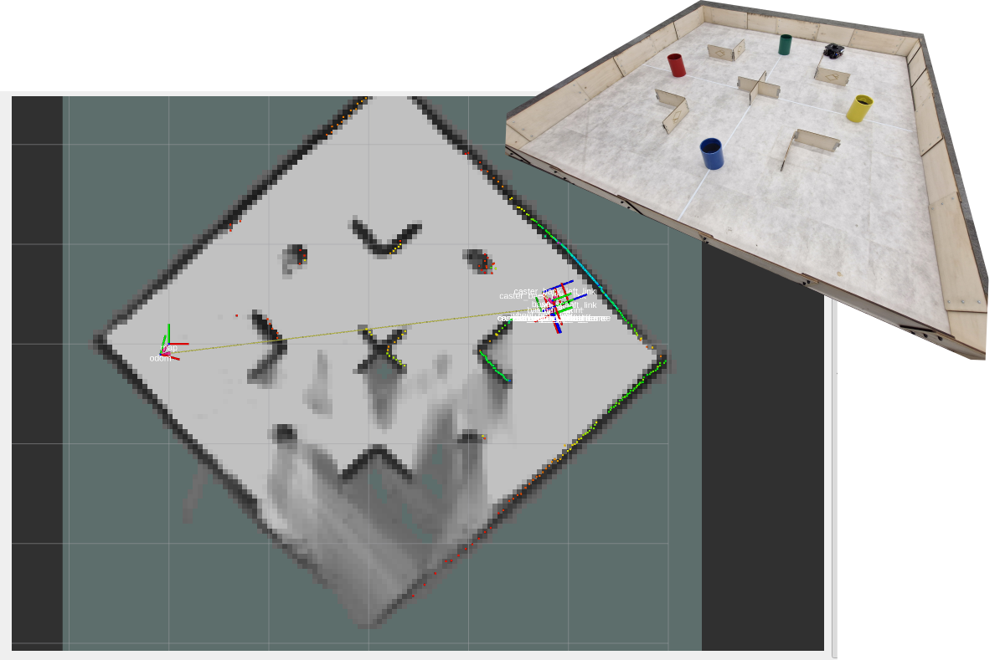
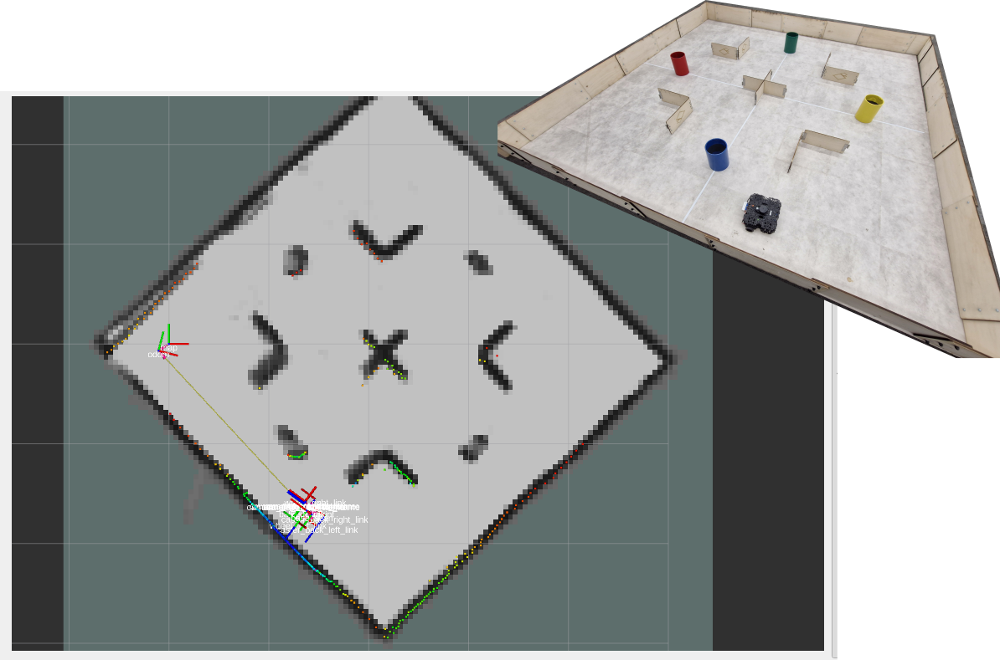

---  
title: "Waffle (& ROS) Basics"  
---

# Waffle (& ROS) Basics

Having completed the steps on [the previous page](./launching-ros.md), your robot and laptop should now be paired, and ROS should be up and running (on the robot). Now, you're ready to bring the robot to life! 

On this page are a series of exercises for you to work through, to see how the robots work. We'll also talk through some core ROS concepts and use some key ROS tools, in case you haven't had a chance to explore these in simulation yet.

### Quick Links

* [Exercise 1: Making the Robot Move](#exMove)
* [Exercise 2: Seeing the Sensors in Action](#exViz)
* [Exercise 3: Visualising the ROS Network](#exNet)
* [Exercise 4: Exploring ROS Topics and Interfaces](#exTopicMsg)
* [Exercise 5: A Python Velocity Control Node](#exSimpleVelCtrl)
* [Exercise 6: Using SLAM to create a map of the environment](#exSlam)

## Manual Control

#### :material-pen: Exercise 1: Making the Robot Move {#exMove}

There's a very useful ready-made ROS application called `teleop_keyboard` (from the `turtlebot3_teleop` package) that we will use to drive a Waffle around. This node works in exactly the same way in both simulation and in the real-world!

1. You should already have two terminal instances active:

    * **TERMINAL 1**: The *robot* terminal with the *"bringup"* processes running ([Launching ROS, Step 3](./launching-ros.md#step-3-launching-ros))
    * **TERMINAL 2**: The *laptop* terminal with the `rmw_zenohd` node running ([Launching ROS, Step 4](./launching-ros.md#step-4-connecting-to-the-zenoh-router))

1. Open up a new terminal instance on the laptop either by using the ++ctrl+alt+t++ keyboard shortcut, or by clicking the Terminal App icon, we'll refer to this as **TERMINAL 3**. In this terminal enter the following `ros2 run` command to fire up the `teleop_keyboard` node:

    ```bash
    ros2 run turtlebot3_teleop teleop_keyboard
    ```
    
1. Follow the instructions provided in the terminal to drive the robot around using specific buttons on the keyboard:

    <figure markdown>
      
    </figure>

    !!! warning 
        Take care to avoid any obstacles or other people in the lab as you do this!

2. Once you've spent a bit of time on this, close the application down by entering ++ctrl+c++ in **TERMINAL 3**.

## Packages and Nodes

ROS applications are organised into *packages*. Packages are basically folders containing scripts, configurations and launch files (ways to launch those scripts and configurations).  

*Scripts* tell the robot what to do and how to act. In ROS, these scripts are called *nodes*. *ROS Nodes* are executable programs that perform specific robot tasks and operations. These are typically written in C++ or Python, but it's possible to write ROS Nodes using other programming languages too.

There are two key ways to launch ROS applications:

1. `ros2 launch`
1. `ros2 run`

Recall that we just used the `ros2 run` command in Exercise 1 to launch the `teleop_keyboard` node. This command has the following structure:

``` { .bash .no-copy }
ros2 run {[1] Package name} {[2] Node name}
```    

**Part [1]** specifies the name of the *ROS package* containing the functionality that we want to execute. **Part [2]** is used to specify a *single* script within that package that we want to execute. We therefore use `ros2 run` commands to launch **single** executables (aka *Nodes*) onto the ROS network (in Exercise 1 for example, we launched the `teleop_keyboard` node).

The `ros2 launch` command has a *similar* structure:

``` { .bash .no-copy }
ros2 launch {[1] Package name} {[2] Launch file}
```

Here, **Part [1]** is the same as the `ros2 run` command, but **Part [2]** is slightly different: `{[2] Launch file}`. In this case, **Part [2]** is a file within that package that specifies any number of Nodes that we want to launch onto the ROS network. We can therefore launch *multiple* nodes at the same time from a single launch file.

## Sensors & Visualisation Tools

Our Waffles have some pretty sophisticated sensors on them, allowing them to "see" the world around them. Let's now see what our robot sees, using some handy ROS tools.

#### :material-pen: Exercise 2: Seeing the Sensors in Action {#exViz}

1. There shouldn't be anything running in **TERMINAL 3** now, after you closed down the `teleop_keyboard` node (using ++ctrl+c++) at the end of the previous exercise. Return to this terminal and enter the following command:

    ```bash
    ros2 launch tuos_tb3_tools rviz.launch.py
    ```
    
    This will launch an application called *RViz*, which is a handy tool that allows us to *visualise* the data from all the sensors on-board our robots. When RViz opens, you should see something similar to the following:

    <figure markdown>
      {width=700px}
    </figure>

    Click on the checkbox next to *"Camera"* in the *"Displays"* list to enable camera subscription. A live feed from the robot's camera should then be displayed in the *Camera* panel in the bottom left.
    
1. In the main RViz panel you should see a digital model of the robot, surrounded by lots of green dots. This is a representation of the *laser displacement data* coming from the LiDAR sensor (the black device on the top of the robot). The LiDAR sensor spins continuously, sending out laser pulses into the environment as it does so. When a pulse hits an object it is reflected back to the sensor, and the time it takes for this to happen is used to calculate how far away the object is.
    
    The LiDAR sensor spins and performs this process continuously, so a full 360&deg; scan of the environment can be generated. This data is therefore really useful for things like *obstacle avoidance* and *mapping*.

1. Place your hand in front of the robot and see if the position of the green dots changes to match your hand's location. Move your hand up and down and consider at what height the LiDAR sensor is able to detect it.

1. Then, move your hand closer and further away and watch how the green dots move to match this. 

1. Open up a new terminal instance (**TERMINAL 4**) and launch the `teleop_keyboard` node as you did in Exercise 1. Watch how the data in the RViz screen changes as you drive the robot around a bit.

#### :material-pen: Exercise 3: Visualising the ROS Network {#exNet}

Using `ros2 run` and `ros2 launch`, as we have done so far, it's easy to end up with a lot of different processes or *ROS Nodes* running on the network, some of which we will interact with, but others may just be running in the background. It is often useful to know exactly what *is* running on the ROS network, and there are a few ways to do this.

1. Open up a new terminal instance now (**TERMINAL 5**) and from here use the `ros2 node` command to *list* the nodes that are currently running:

    ```bash
    ros2 node list
    ```
    
    At a *minimum*, you should be presented with the following list: 
    
    ``` { .txt .no-copy }
    /camera
    /diff_drive_controller
    /hlds_laser_publisher
    /robot_state_publisher
    /tb3_status_node
    /turtlebot3_node
    ```

2. We can visualise the connections between the active nodes by using a ROS node called `rqt_graph`. In the same terminal, launch this as follows:

    ```bash
    rqt
    ```
    
    A window should then open:

    <figure markdown>
      {width=600}
    </figure>

1. From here, we then want to load the *Node Graph* plugin. From the top menu select `Plugins` > `Introspection` > `Node Graph`.

    ??? tip "Shortcut"
        You can also launch the `rqt_graph` node directly with `ros2 run`:
        
        ```bash
        ros2 run rqt_graph rqt_graph
        ```

1. In the window that opens, select `Nodes/Topics (active)` from the dropdown menu in the top left. 

    What you should then see is a map of all the nodes in the list from above (as ovals), and arrows to illustrate the flow of information between them. This is a visual representation of the ROS network!

    <figure markdown>
      {width=600px}
    </figure>
    
    Items that have a rectangular border are *ROS Topics*. ROS Topics are essentially communication channels, and ROS Nodes can read (*subscribe*) or write (*publish*) to these topics to access sensor data, pass information around the network and make things happen.

    If the `teleop_keyboard` Node is still active (in **TERMINAL 4**) then the graph should show us that this node is publishing messages to a topic called `/cmd_vel`, which in turn is being subscribed to by `turtlebot3_node`. 

    <figure markdown>
      {width=600px}
    </figure>

    This node runs on the robot and controls its velocity. We send instructions to this (by publishing to the `/cmd_vel` topic) to actually make the robot move.

A ROS Robot could have hundreds of individual nodes running simultaneously to carry out all its necessary operations and actions. Each node runs independently, but uses *ROS communication methods* to communicate and share data with the other nodes on the ROS Network.

## Publishers and Subscribers: A *ROS Communication Method* 

ROS Topics are therefore key to making things happen on a robot. Nodes can publish (*write*) and/or subscribe to (*read*) ROS Topics in order to share data around the ROS network. Data is published to topics via *message-type interfaces*.

Let's have a look at this in a bit more detail...

#### :material-pen: Exercise 4: Exploring ROS Topics and Interfaces {#exTopicMsg}

Much like the `ros2 node list` command, we can use `ros2 topic list` to list all the *topics* that are currently active on the ROS network.

1. Close down the RQT Graph window if you haven't done so already. This will release **TERMINAL 5** so that we can enter commands in it again. Return to this terminal window and enter the following:

    ```bash
    ros2 topic list
    ```
    
    A new list of items should be printed to the terminal now. See if you can spot the `/cmd_vel` item in the list.
    
    As we learnt above, this topic is used to control the velocity of the robot (*'command velocity'*).

1. Let's find out more about this using the `ros2 topic info` command.

    ```bash
    ros2 topic info /cmd_vel
    ```
    
    This should provide an output similar to the following: 
    
    ``` { .txt .no-copy }
    Type: geometry_msgs/msg/TwistStamped
    Publisher count: 1
    Subscription count: 1
    ```

    This tells us that the *type* of data being communicated on the `/cmd_vel` topic is called: `geometry_msgs/msg/TwistStamped`. 
    
    The interface description has three parts:

    1. `geometry_msgs`: The name of the ROS package that this interface belongs to.
    1. `msg`: The type of interface. In this case *message*, but there are other types too. 
    1. `TwistStamped`: The name of the message interface. 

    We have just learnt then, that if we want to make the robot move we need to publish `TwistStamped` *messages* to the `/cmd_vel` topic. 

1. We can use the `ros2 interface` command to find out more about the `TwistStamped` message:

    ```bash
    ros2 interface show geometry_msgs/msg/TwistStamped
    ```
    
    From this, we should obtain the following:

    ``` { .txt .no-copy }
    std_msgs/Header header
            builtin_interfaces/Time stamp
                    int32 sec
                    uint32 nanosec
            string frame_id
    Twist twist
            Vector3  linear
                    float64 x
                    float64 y
                    float64 z
            Vector3  angular
                    float64 x
                    float64 y
                    float64 z
    ```

    Here we have a list of fields, subfields and data types. The interface has two *base fields* (indicated by the lines that are not indented):

    <center>

    | # | Field *Name* | Field *Type* |
    | :---: | :---: | :---: |
    | 1 | `header` | `std_msgs/Header` |
    | 2 | `twist` | `Twist` |
    
    </center>
    
    Of the above, we're most interested in *Field 2*, which contains a further two subfields: 
    
    <center>

    | # | Field *Name* | Field *Type* |
    | :---: | :---: | :---: |
    | 1 | `linear` | `Vector3` |
    | 2 | `angular` | `Vector3` |
    
    </center>

    Each of *these* contains 3 *further* subfields: `x`, `y` and `z`:

    <center>

    | # | Field Name | Data Type |
    | :---: | :---: | :---: |
    | 1 | `x` | `float64` |
    | 2 | `y` | `float64` |
    | 3 | `z` | `float64` |

    </center>

    Let's find out what this all means...

## Velocity Control

The motion of any mobile robot can be defined in terms of its three *principal axes*: `X`, `Y` and `Z`. In the context of our TurtleBot3 Waffle, these axes (and the motion about them) are defined as follows:

<figure markdown>
  {width=600}
</figure>

In theory then, a robot can move *linearly* or *angularly* about any of these three axes, as shown by the arrows in the figure. That's six *Degrees of Freedom* (DOFs) in total, achieved based on a robot's design and the actuators it is equipped with. Take a look back at the `ros2 interface show` output above. Hopefully it's a bit clearer now that the `twist` subfield of the `TwistStamped` interface is formatted to give a ROS Programmer the ability to *ask* a robot to move in any one of its six DOFs. 

``` { .txt .no-copy }
Vector3  linear
        float64 x  <-- Forwards (or Backwards)
        float64 y  <-- Left (or Right)
        float64 z  <-- Up (or Down)
Vector3  angular
        float64 x  <-- "Roll"
        float64 y  <-- "Pitch"
        float64 z  <-- "Yaw"
```

Our TurtleBot3 robot only has two motors, so it doesn't actually have six DOFs! The two motors can be controlled independently, which gives it what is called a *"differential drive"* configuration, but this still only allows it to move with **two degrees of freedom** in total, as illustrated below.

<figure markdown>
  {width=600}
</figure>

It can therefore only move **linearly** in the **x-axis** (*Forwards/Backwards*) and **angularly** in the **z-axis** (*Yaw*). 

#### :material-pen: Exercise 5: A Python Velocity Control Node {#exSimpleVelCtrl}

!!! important
    Before you start this, make sure you have nothing running in **TERMINALS** **3**, **4** & **5** (enter ++ctrl+c++ in each of these terminals to stop any processes that may be running there).

As we've seen, making a robot move with ROS is simply a case of publishing the right data (`geometry_msgs/msg/TwistStamped`) to the right ROS Topic (`/cmd_vel`). Earlier we used the `teleop_keyboard` node to drive the robot around, a bit like a remote control car. In the background here all that was really happening was that the node was converting our keyboard button presses into velocity commands and publishing these to the `/cmd_vel` topic.

In reality, robots need to be able to navigate complex environments autonomously, which is quite a difficult task, and requires us to build bespoke applications. We can build these applications using Python, and we'll look at the core concepts behind this now by building a simple node that will allow us to make our robot a bit more "autonomous". What we will do here forms the basis of the more complex applications that you will learn about in the lab course!

1. Above, we talked about how ROS Nodes should be contained within packages, so let's create one now using a helper script that we've already put together. (This is covered in more detail in the ROS course, but for the purposes of this exercise let's just go ahead and run the script without worrying too much about it!)

    In **TERMINAL 3**, navigate to *the ROS2 Workspace* on the laptop:

    ```bash
    cd ~/ros2_ws/src/
    ```

1. From here, use `git` to *clone* our *"ROS 2 Package Template"* from GitHub:

    ```bash
    git clone https://github.com/tom-howard/ros2_pkg_template.git
    ```
    
1. This package template contains a script called `init_pkg.sh`, which can be called to turn the template into a proper ROS 2 package. Run the script as follows, which will convert the template into a ROS 2 package called `waffle_demo`:

    ```bash
    ./ros2_pkg_template/init_pkg.sh waffle_demo
    ```

1. Navigate into this new package directory (using `cd`):

    ```bash
    cd waffle_demo/ 
    ```

1. This package contains a subdirectory called `scripts`, and within this there are two basic nodes to get us started:

    ```bash
    tree scripts/
    ```
    ``` { .txt .no-copy}
    scripts/
    ├── basic_velocity_control.py
    └── stop_me.py
    ```

1. Let's open up our package now in *Visual Studio Code* (VS Code). 

    ```bash
    code .
    ```

    !!! note
        Don't forget to include the `.` at the end there, it's important!!

    
1. Next, in the VS Code file explorer, open up the `scripts` directory, find the `basic_velocity_control.py` file and click it to open it up in the editor.

    <a name="timedSquareCode"></a>

    This is a (fairly) basic ROS 2 Python Node that will control the velocity of the robot. Let's talk through it:
    
    1. First, we have some imports:

        ``` { .py .no-copy }
        import rclpy # (1)!
        from geometry_msgs.msg import TwistStamped # (2)!
        import time # (3)!
        ```

        1. `rclpy` is the ROS client library for Python. We need this so that our Python node can interact with ROS.
        2. [We know from earlier](#ex4) that in order to make a robot move we need to publish messages to the `/cmd_vel` topic, and that this topic uses a data structure (or Interface) called `geometry_msgs/msg/TwistStamped`. This is how we import the interface into our Python node so that we can create velocity commands for our robot (which we'll get to shortly...)
        3. We'll use this to control timing in our node.

        Click on the :material-plus-circle: icons above to reveal more information about each line of the code.

    1. Next, we declare some variables that we can use and adapt during the main execution of our code:

        ``` { .py .no-copy }
        state = 1 # (1)!
        vel = TwistStamped() # (2)!
        ```

        1. Inside the `#!py while` loop (explained shortly) we define two different operational states for the robot, and we can control which one is active by changing this value from `1` to `2` (and visa-versa).
        2. We're instantiating a `TwistStamped` Interface message here and calling it `vel`. We'll assign velocity values to this in the `#!py while` loop later on.
            
            Recall that a `TwistStamped` message contains six different components that we can assign values to. [Which *two* are relevant to our robot](#velocity-control)?

    1. Next we configure some important ROS-related things:

        ``` { .py .no-copy }
        rclpy.init(args=None) # (1)!
        node = rclpy.create_node("basic_velocity_control")  # (2)!
        vel_pub = node.create_publisher(TwistStamped, "cmd_vel", 10)  # (3)!
        ```

        1. Initialise `rclpy` and all the ROS communications that are necessary for our node. 
        2. Initialise this Python script as an actual ROS node, providing a name for it to be registered on the ROS network with ("basic_velocity_control" in this case).
        3. Here we're setting up a publisher to the `/cmd_vel` topic so that the node can send velocity commands to the robot (using `TwistStamped` data).

    1. After this, we're defining another variable:

        ``` { .py .no-copy }
        timestamp = node.get_clock().now().nanoseconds # (1)!
        ```

        1. What time is it right now? This tells us the current "ROS Time" (in nanoseconds), which will be useful to compare against in the while loop.

    1. Now, we enter into a `#!py while` loop, which is where our code will spend the majority of its time once it's up and running:

        ``` { .py .no-copy }
        while rclpy.ok(): # (1)!
            time_now = node.get_clock().now().nanoseconds # (2)!
            elapsed_time = (time_now - timestamp) * 1e-9 # (3)!

            ...

        ```

        1. This returns `#!py True` as long as the node is alive, so all the code inside the `#!py while` loop will continue to execute as long as this is the case.
        2. What time is it *now*? Check the time at the start of each iteration of the `#!py while` loop, and assign this to a variable called `time_now`.
        3. Determine how much time has elapsed (in seconds) since the `timestamp` was last updated.

        <a name="break"></a>

        1. An `#!py if` statement now controls the state of operation for our robot. 
            
            1. In state `1` we set velocities that will make the robot move forwards (linear X velocity only) for a certain amount of time and then stop. How long will the robot move forwards for, and at what velocity?

                ``` { .py .no-copy }
                if state == 1: 
                    if elapsed_time < 2: # (1)!
                        vel.twist.linear.x = 0.05 # (2)!
                        vel.twist.angular.z = 0.0
                    else: # (3)!
                        vel.twist.linear.x = 0.0 # (4)!
                        vel.twist.angular.z = 0.0
                        state = 2 # (5)!
                        timestamp = node.get_clock().now().nanoseconds # (6)!
                ```

                1. If the elapsed time is less than 2 seconds...
                2. Set a linear velocity so that the robot will move forwards.
                3. If the elapsed time has *exceeded* 2 seconds...
                4. Set our robot's velocities to `0.0` to make it stop.
                5. In the next loop iteration, go into state 2 instead.
                6. Reset the timestamp to start counting up again. 

            2. In state `2` we set velocities that will make the robot turn on the spot (angular Z velocity only) for a certain amount of time and then stop. How long will it do this for, and at what velocity?
                
                ``` { .py .no-copy }
                elif state == 2:
                    if elapsed_time < 4: # (1)!
                        vel.twist.linear.x = 0.0
                        vel.twist.angular.z = 0.2 # (2)!
                    else: # (3)!
                        vel.twist.linear.x = 0.0 # (4)!
                        vel.twist.angular.z = 0.0 
                        state = 1 # (5)!
                        timestamp = node.get_clock().now().nanoseconds # (6)!
                ```

                1. While the elapsed time is less than 4 seconds...
                2. Apply an angular velocity to the robot to make it turn on the spot.
                3. Once the elapsed time has *exceeded* 4 seconds...
                4. Set the robot's velocities back to `0.0` to make it stop.
                5. In the next loop iteration, go back into state 1 again (moving forwards).
                6. Reset the timestamp to start counting up once more. 

        1. And after the `#!py if` statement:

            ``` { .py .no-copy }
            node.get_logger().info( # (1)!
                f"\n[State = {state}] Publishing velocities:\n"
                f"  - linear.x: {vel.twist.linear.x:.2f} [m/s]\n"
                f"  - angular.z: {vel.twist.angular.z:.2f} [rad/s].",
                throttle_duration_sec=1,
            )
            vel_pub.publish(vel) # (2)!
            ```

            1. This (and the following 5 lines) will print a message to the terminal, to provide us with regular updates on what state the node is currently in and what velocities have been set (in the `#!py if` statement above).
            2. This line is crucial: this operation actual publishes the velocity commands to the `/cmd_vel` topic, to make the robot actual act on our instructions.

                Regardless of what happens in the `if` states above, we *always* publish a velocity command to the `/cmd_vel` topic here (every loop iteration).


1. We're now ready to build our package so that we can run it. We use a tool called "Colcon" to do this, but this **MUST** be run from the root of the ROS 2 Workspace (i.e.: `~/ros2_ws/`), so let's navigate there now using `cd`. Head back to **TERMINAL 3** and run the following:

    ```bash
    cd ~/ros2_ws/ 
    ```

    Then, use the `colcon build` command to build your package:

    ```bash
    colcon build --packages-select waffle_demo --symlink-install
    ```
    
    And finally, "re-source" the environment:

    ```bash
    source ~/.bashrc
    ```
    
1. Now we can run the code.

    !!! note
        Make sure the robot is on the floor and has enough room to roam around before you do this!
    
    ``` { .bash .no-copy }
    ros2 run waffle_demo square.py
    ```
    
    Observe what the robot does. When you've seen enough, enter ++ctrl+c++ to stop the node.

    !!! warning
        The robot will continue to move even after you've stopped the node! Run the following command to stop it:
        
        ```bash
        ros2 run waffle_demo stop_me.py
        ```
    
5. Now it's time to **adapt the code**:
    
    The aim here is to make the robot follow a square motion path. What you may have observed when you actually ran the code is that the robot doesn't actually do that! We're using a time-based approach to make the robot switch between two different states continuously:
    
    1. Moving forwards
    2. Turning on the spot
    
    Have a look at the code to work out how much time the robot will currently spend in each state.
    
    We want the robot to follow a **0.5m x 0.5m square** motion path.  In order to properly achieve this you'll need to adjust the timings, or the robot's velocity, or both. Edit the code so that the robot actually follows a **0.5m x 0.5m square motion path**!

## SLAM

Simultaneous Localisation and Mapping (SLAM) is a sophisticated tool that is built into ROS. Using data from the robot's LiDAR sensor, plus knowledge of how far the robot has moved[^odom] a robot is able to create a map of its environment *and* keep track of its location within that environment at the same time. In the exercise that follows you'll see how easy it is to implement SLAM with the Waffle.  

[^odom]: You'll learn much more about "Robot Odometry" in the lab course.

#### :material-pen: Exercise 6: Using SLAM to create a map of the environment {#exSlam}

1. In **TERMINAL 3** enter the following command to launch all the necessary SLAM nodes:

    ```bash
    ros2 launch tuos_tb3_tools slam.launch.py environment:=real
    ```
    
    ??? tip
        On the laptop, this command is also available as an alias: `tb3_slam`!

    This will launch a new RViz instance, showing a top-down view of the environment, and dots of various colours representing the real-time LiDAR data. 
    
    <figure markdown>
      {width=600px}
    </figure>

    SLAM will already have begun processing this data to start building a map of the boundaries that are currently visible to the Waffle based on its location in the environment.

1. Return to **TERMINAL 4** now and launch the `teleop_keyboard` node. Start to drive the robot around *slowly* and *carefully* to build up a complete map of the area.
    
    !!! tip
        It's best to do this slowly and perform multiple circuits of the area to build up a more accurate map.

    <a name="slam-steps"></a>

    <figure markdown>
      {width=500px}
      {width=500px}
      {width=500px}
    </figure>

1. Once you're happy that your robot has built up a good map of its environment, you can save this map using the `map_saver_cli` node from a package called `nav2_map_server`:

    1. First, create a new directory within your ROS package on the laptop. Return to **TERMINAL 5** and navigate to the root of the `waffle_demo` package that you created earlier:

        ```bash
        cd ~/ros2_ws/src/waffle_demo
        ```
        
    1. Create a directory in here called `maps`: 
        
        ```bash
        mkdir maps
        ```
        
    1. Navigate into this directory:

        ```bash
        cd maps/
        ```
        
    1. Then, use `ros2 run` to run the `map_saver_cli` node and save a copy of your robot's map:

        ``` { .bash .no-copy }
        ros2 run nav2_map_server map_saver_cli -f MAP_NAME
        ```
        
        Replacing `MAP_NAME` with an appropriate name for your map. This will create two files: 
        
        1. a `MAP_NAME.pgm` 
        2. a `MAP_NAME.yaml` file
        
        ...both of which contain data related to the map that you have just created.

    1. The `.pgm` file can be opened using an application called `eog` on the laptop: 
    
        ``` { .bash .no-copy }
        eog MAP_NAME.pgm
        ```
        
1. Return to **TERMINAL 3** and close down SLAM by pressing ++ctrl+c++. The process should stop and RViz should close down.

1. Close down the `teleop_keyboard` node in **TERMINAL 4** as well, if that's still running.

## Next Steps

"**Pro Tips**": There are some important things to consider when working with the Real Waffles. [Move onto the next page to find out more](./essentials.md)...

... and when you've done that, don't forget to [power off your robot properly](./shutdown.md). 